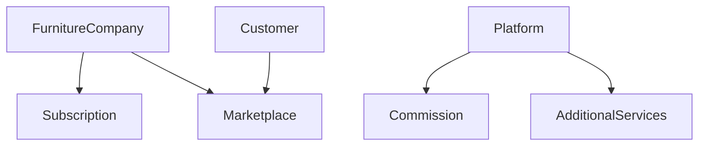
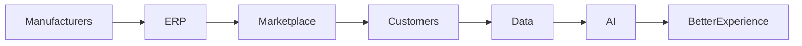

# Business Model

## 1. Overview

Furniture Platform SaaS + Marketplace + Digital Commerce modeli asosida ishlaydi.

Platformaning asosiy biznes maqsadi:

* mebel kompaniyalariga boshqaruv tizimi berish;
* mijozlarga qulay xarid tajribasi yaratish;
* ishlab chiqaruvchilar va mijozlarni yagona ekotizimga birlashtirish.

Daromad bir nechta manbadan shakllanadi:

1. Subscription
2. Marketplace commission
3. Additional modules
4. Enterprise solutions

---

# 2. Business Model Structure



---

# 3. Customer Segments

## 3.1 Furniture Manufacturers

Asosiy B2B mijozlar.

Ularning ehtiyojlari:

* ishlab chiqarishni boshqarish;
* xarajatlarni nazorat qilish;
* mijoz topish;
* mahsulotlarni raqamli ko'rsatish;
* buyurtmalarni kuzatish.

---

## 3.2 Furniture Stores

Vazifalari:

* tayyor mahsulot sotish;
* katalog yuritish;
* mijozlar bilan ishlash.

---

## 3.3 Employees

Xodimlar uchun:

* mobil ilova;
* mijoz uyiga tashrif;
* AR namoyish;
* buyurtma yangilash.

---

## 3.4 Customers

Mijozlar:

* mahsulot tanlaydi;
* AR orqali ko'radi;
* buyurtma beradi;
* jarayonni kuzatadi.

---

# 4. Revenue Streams

# 4.1 Subscription Model

Platformaning asosiy daromad manbai.

---

# Starter Plan

Maqsad:

Kichik ustalar va yangi kompaniyalar.

Funksiyalar:

* kompaniya profili;
* mahsulot katalogi;
* oddiy buyurtmalar;
* mijozlar ro'yxati.

Cheklovlar:

* mahsulot soni;
* xodim soni;
* AR imkoniyatlari.

---

# Professional Plan

Maqsad:

O'rta va rivojlanayotgan mebel kompaniyalari.

Funksiyalar:

Starter +

* ERP modullari;
* ombor boshqaruvi;
* material hisobi;
* ishlab chiqarish jarayoni;
* AR showroom;
* xodim mobil ilovasi.

---

# Enterprise Plan

Maqsad:

Yirik ishlab chiqaruvchilar.

Funksiyalar:

Professional +

* ko'p filial;
* maxsus integratsiyalar;
* API access;
* kengaytirilgan analitika;
* individual konfiguratsiya.

---

# 5. Marketplace Revenue

Marketplace platformaning ikkinchi katta daromad manbai.

## Commission Model

Buyurtma platforma orqali amalga oshirilsa:

```text
Customer
    |
    |
Marketplace
    |
    |
Furniture Company
```

Platforma:

* foizli komissiya;
* xizmat haqi

olishi mumkin.

---

# 6. AR Monetization

AR alohida premium qiymat beradi.

Variantlar:

## AR Package

Qo'shimcha to'lov:

* 3D model joylashtirish;
* AR preview;
* ko'p variant sinash.

---

## Customer Premium

Mijozlar uchun:

Free:

* bitta model ko'rish.

Premium:

* bir nechta model;
* xona saqlash;
* dizayn variantlari;
* AI tavsiyalar.

---

# 7. Additional Modules

Platforma plugin arxitekturasiga ega bo'ladi.

Qo'shimcha paketlar:

## Interior Package

* Oboy AR
* Pol AR
* Pardalar
* Yoritish

---

## Construction Package

* Deraza
* Eshik
* Oshxona dizayni

---

## AI Package

* AI dizayner
* Narx optimizatsiyasi
* Material tavsiyasi

---

# 8. Marketplace Growth Strategy

## Phase 1

O'zbekiston:

* 20 ta pilot mebelchi;
* mahsulot katalogi;
* AR tajribasi.

---

## Phase 2

Regional expansion:

* Qozog'iston;
* Qirg'iziston;
* Tojikiston.

---

## Phase 3

Global:

* Turkiya;
* Yaqin Sharq;
* Yevropa.

---

# 9. Country Expansion Model

Har bir davlat mustaqil konfiguratsiya orqali qo'shiladi.

```json
{
 "country": "Kazakhstan",
 "currency": "KZT",
 "language": "kk",
 "market_status": "pilot",
 "orders_enabled": false
}
```

---

# 10. Customer Acquisition

## Furniture Companies

Kanallar:

* to'g'ridan-to'g'ri sotuv;
* demo;
* hamkorlik;
* tavsiyalar.

---

## Customers

Kanallar:

* AR videolar;
* ijtimoiy tarmoqlar;
* marketplace SEO;
* foydalanuvchi yaratgan kontent.

---

# 11. Viral Growth Strategy

Platformaning tabiiy marketing mexanizmi:

```text
Customer uses AR
        |
        |
Creates video
        |
        |
Shares social media
        |
        |
New customers arrive
```

AR tajribasi foydalanuvchilar tomonidan tarqaladigan kontent yaratadi.

---

# 12. Key Business Metrics

## SaaS Metrics

* MRR
* ARR
* Churn Rate
* Customer Lifetime Value
* Customer Acquisition Cost

---

## Marketplace Metrics

* Active sellers
* Orders
* GMV
* Conversion rate

---

## Product Metrics

* AR sessions
* Saved designs
* Customer requests
* Completed orders

---

# 13. Long Term Business Goal

Furniture Platform quyidagi modelga aylanadi:



Natijada platforma:

* mebel bizneslarini boshqaradi;
* mijozlarga tanlash imkonini beradi;
* bozor ma'lumotlarini yig'adi;
* yangi xizmatlarni qo'shish imkonini beradi.

---

# 14. Summary

Furniture Platform biznes modeli:

**SaaS + Marketplace + AR Commerce + AI**

kombinatsiyasiga asoslanadi.

Asosiy strategik aktivlar:

1. Mebel kompaniyalari tarmog'i.
2. Mahsulot va 3D katalog.
3. Ishlab chiqarish ma'lumotlari.
4. Mijozlar oqimi.
5. AR tajribasi.
