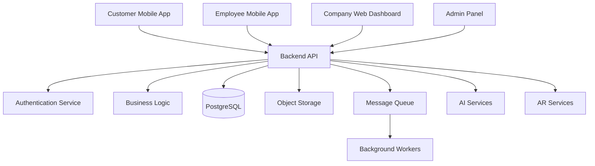
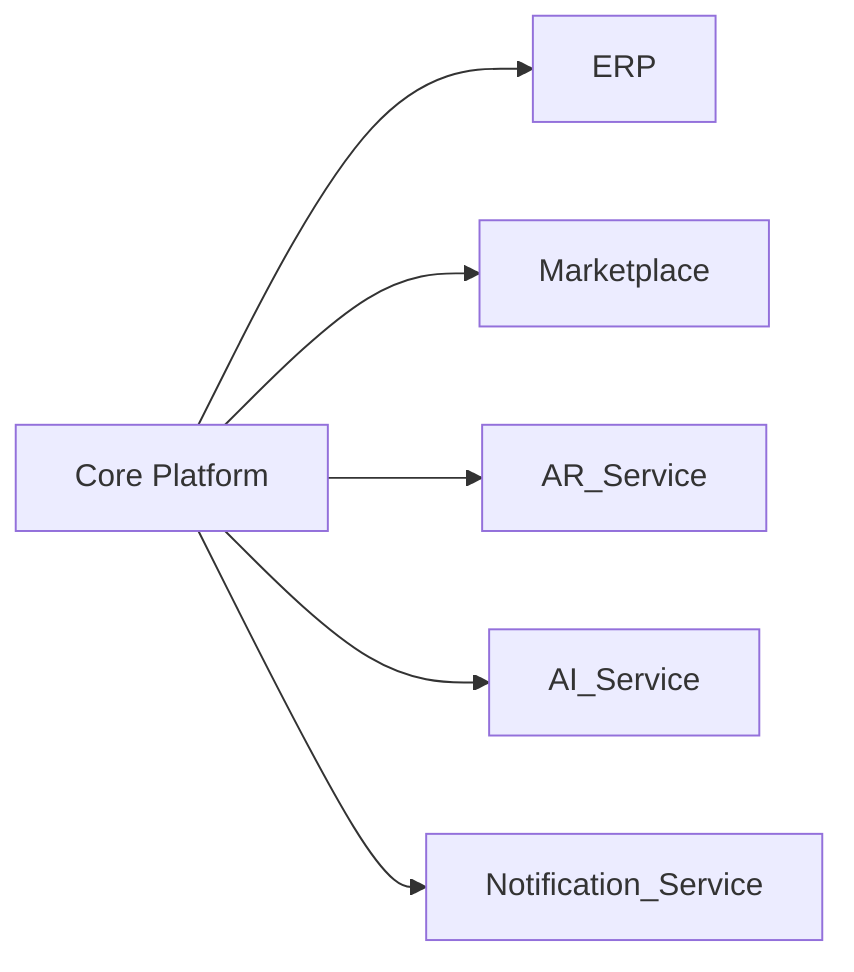
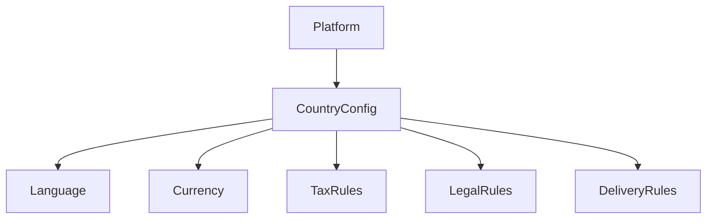
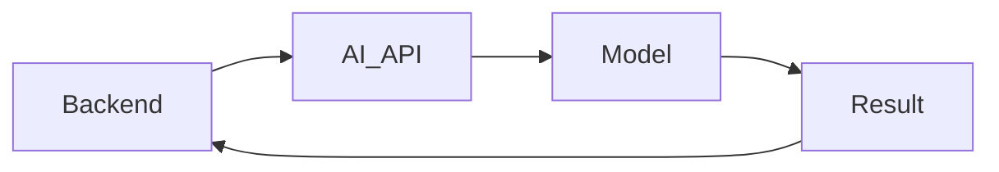
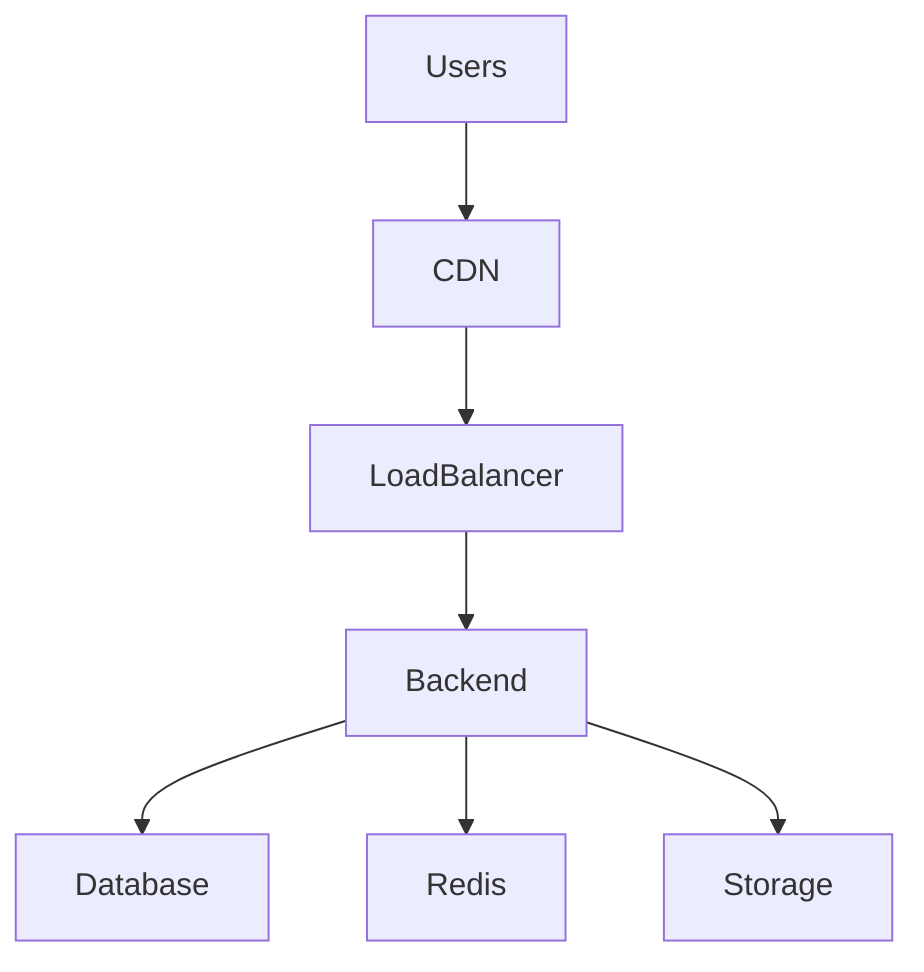

# System Architecture

## 1. Overview

Furniture Platform ko'p qatlamli (layered) va kengaytiriladigan arxitektura asosida quriladi.

Asosiy maqsadlar:

* yuqori yuklamaga tayyor bo'lish;
* yangi davlatlarni qo'shish imkoniyati;
* yangi modullarni plugin sifatida ulash;
* mobil va web platformalarni qo'llab-quvvatlash;
* AI va AR servislarini alohida rivojlantirish.

---

# 2. High Level Architecture

---

# 3. Application Layers

## 3.1 Client Layer

Platformada bir nechta client mavjud:

### Customer Application

Vazifalar:

* marketplace ko'rish;
* AR preview;
* buyurtma berish;
* status kuzatish.

---

### Employee Mobile Application

Vazifalar:

* mijoz uyiga tashrif;
* AR namoyish;
* o'lchov olish;
* buyurtma yangilash.

---

### Company Dashboard

Vazifalar:

* ERP boshqaruvi;
* mahsulot boshqaruvi;
* ishlab chiqarish;
* xodimlar.

---

### Admin Panel

Vazifalar:

* platforma nazorati;
* kompaniya tasdiqlash;
* davlat sozlamalari;
* monitoring.

---

# 4. Backend Architecture

## Backend Responsibilities

Backend quyidagilarni boshqaradi:

* authentication;
* authorization;
* business logic;
* order flow;
* ERP logic;
* marketplace;
* payments;
* notifications;
* integrations.

---

# 5. Recommended Technology Stack

## Backend

Asosiy variant:

* Python
* Django / Django REST Framework

Sabab:

* tez rivojlantirish;
* katta ecosystem;
* admin panel;
* ERP tizimlari uchun mos.

---

## Database

Primary database:

* PostgreSQL

Sabab:

* katta ma'lumotlar;
* murakkab relations;
* JSON support;
* scalability.

---

## Cache Layer

Redis:

Vazifalar:

* cache;
* session;
* real-time data;
* queue.

---

## Background Processing

Celery yoki shunga o'xshash worker tizimi:

Vazifalar:

* AI processing;
* notification;
* report generation;
* image processing.

---

# 6. Storage Architecture

Platformada ko'p media mavjud:

* 3D model;
* rasmlar;
* videolar;
* hujjatlar.

Shuning uchun:

Object Storage:

* S3 compatible storage
* MinIO
* Cloud Storage

ishlatiladi.

---

# 7. Microservice Ready Design

Boshlanishida:

Modular Monolith.

Keyinchalik:

Microservices.

Arxitektura:

---

# 8. Main Modules

## Core Module

Platformaning asosiy qismi:

* users;
* companies;
* permissions;
* settings.

---

## ERP Module

Mas'ul:

* inventory;
* production;
* employees;
* costs.

---

## Marketplace Module

Mas'ul:

* products;
* categories;
* search;
* orders.

---

## AR Module

Mas'ul:

* 3D assets;
* AR scenes;
* visualization.

---

## AI Module

Mas'ul:

* recommendation;
* pricing;
* analysis.

---

# 9. Real Time Architecture

Kerakli joylarda real-time ishlatiladi:

Misollar:

* buyurtma statusi;
* ishlab chiqarish yangilanishi;
* notification.

Texnologiyalar:

* WebSocket
* Server Sent Events

---

# 10. Notification System

Kanallar:

* Push notification
* Email
* SMS
* Telegram integration

Misollar:

Mijoz:

"Buyurtmangiz ishlab chiqarishga o'tdi."

Usta:

"Yangi buyurtma kelib tushdi."

---

# 11. Multi Country Architecture

Platforma boshidan xalqaro bo'ladi.

Har bir davlat:

---

# 12. Security Architecture

Asosiy tamoyillar:

* Role Based Access Control;
* API authentication;
* encrypted data;
* audit logs.

---

# 13. Scalability Strategy

## Stage 1

1000 foydalanuvchi:

* bitta backend;
* PostgreSQL;
* Redis.

---

## Stage 2

100 000 foydalanuvchi:

* load balancing;
* CDN;
* background workers.

---

## Stage 3

Million foydalanuvchi:

* microservices;
* distributed storage;
* multiple regions.

---

# 14. AI Service Architecture

AI alohida servis sifatida ishlaydi.

Misollar:

* narx taxmini;
* dizayn tavsiyasi;
* material hisoblash.

---

# 15. AR Service Architecture

AR tizimi:

Client:

* camera;
* sensors;
* ARKit/ARCore.

Server:

* 3D model storage;
* metadata;
* optimization.

---

# 16. Deployment Architecture

Production:

---

# 17. Development Principles

Platforma quyidagilarga amal qiladi:

* API First;
* Modular Design;
* Clean Architecture;
* Documentation Driven Development;
* Security First;
* Scalability Ready.

---

# 18. Summary

Furniture Platform arxitekturasi:

* hozirgi MVP uchun sodda;
* kelajakdagi global platforma uchun kengayadigan;
* ERP, Marketplace, AR va AI tizimlarini birlashtira oladigan

qilib loyihalanadi.
