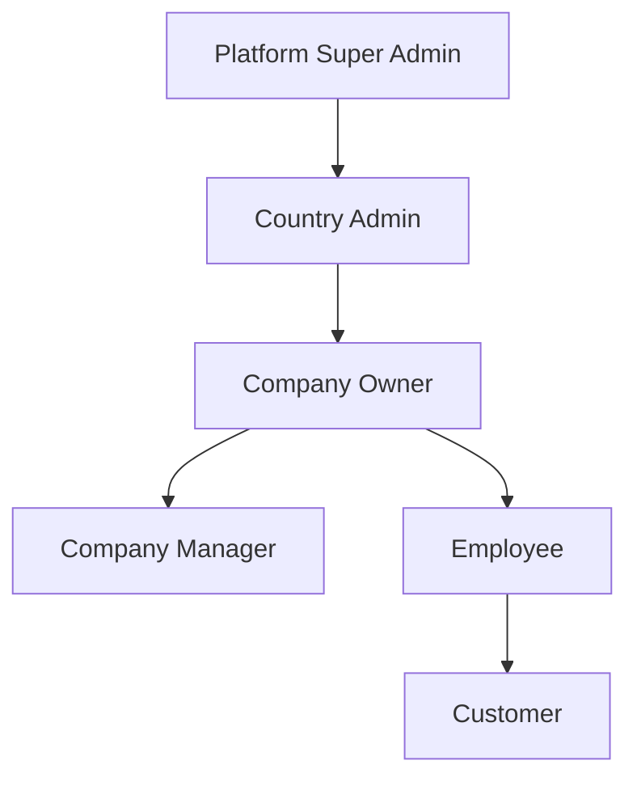

# User Roles & Permission System

## 1. Overview

Furniture Platform ko'p turdagi foydalanuvchilar bilan ishlaydi.

Tizim Role Based Access Control (RBAC) asosida quriladi.

Har bir foydalanuvchi faqat o'ziga tegishli funksiyalar va ma'lumotlarga kirish huquqiga ega bo'ladi.

---

# 2. User Hierarchy



---

# 3. Main User Types

Platformada asosiy rollar:

1. Guest
2. Customer
3. Furniture Company Owner
4. Company Manager
5. Designer
6. Sales Employee
7. Measurement Employee
8. Production Employee
9. Warehouse Employee
10. Delivery Employee
11. Platform Admin
12. Country Admin

---

# 4. Guest User

## Description

Ro'yxatdan o'tmagan foydalanuvchi.

## Permissions

Ruxsat:

* mahsulotlarni ko'rish;
* kompaniyalarni ko'rish;
* AR demo ishlatish;
* platforma haqida ma'lumot olish.

Cheklov:

* buyurtma bera olmaydi;
* saqlangan dizaynlar yo'q;
* tarix mavjud emas.

---

# 5. Customer Role

## Description

Oxirgi xaridor.

## Main Features

### Marketplace

* mahsulot qidirish;
* filtr ishlatish;
* kompaniya ko'rish;
* narx ko'rish.

---

### AR Experience

Customer:

* xonani skan qiladi;
* mebel joylashtiradi;
* rang o'zgartiradi;
* o'lcham variantlarini ko'radi.

---

### Order Management

Customer:

* buyurtma yaratadi;
* status kuzatadi;
* kompaniya bilan aloqa qiladi.

---

## Customer Permissions

```text
VIEW_PRODUCTS
USE_AR
CREATE_ORDER
VIEW_ORDER_STATUS
SEND_MESSAGE
SAVE_DESIGN
```

---

# 6. Furniture Company Owner

## Description

Mebel korxonasi egasi.

Bu asosiy B2B foydalanuvchi.

---

## Main Responsibilities

* kompaniya boshqaruvi;
* xodim qo'shish;
* mahsulot joylash;
* moliyaviy nazorat.

---

## Permissions

```text
MANAGE_COMPANY

MANAGE_PRODUCTS

MANAGE_EMPLOYEES

VIEW_REPORTS

MANAGE_SUBSCRIPTION

VIEW_ANALYTICS
```

---

# 7. Company Manager

## Description

Korxona ichidagi boshqaruvchi.

---

## Permissions

Ruxsat:

* buyurtmalar;
* ishlab chiqarish;
* xodimlar nazorati.

Cheklov:

* tarif o'zgartira olmaydi;
* kompaniyani o'chira olmaydi.

---

# 8. Designer Role

## Description

Mebel dizayneri.

---

## Responsibilities

* mahsulot yaratish;
* 3D model tayyorlash;
* konfiguratsiya.

---

## Permissions

```text
CREATE_PRODUCT

UPLOAD_3D_MODEL

EDIT_DESIGN

CREATE_VARIANTS
```

---

# 9. Sales Employee

## Description

Mijozlar bilan ishlovchi xodim.

---

## Features

* mijozlar bilan aloqa;
* taklif yuborish;
* buyurtma yaratish.

---

## Permissions

```text
CREATE_CUSTOMER

CREATE_ORDER

VIEW_PRODUCTS

USE_AR_PRESENTATION
```

---

# 10. Measurement Employee

## Description

Mijoz uyiga borib o'lchov oluvchi xodim.

---

## Features

Mobil ilova orqali:

* manzil ko'rish;
* tashrif yaratish;
* o'lcham kiritish;
* rasm yuklash.

---

## Permissions

```text
VIEW_ASSIGNMENTS

UPLOAD_MEASUREMENTS

UPLOAD_PHOTOS

UPDATE_VISIT_STATUS
```

---

# 11. Production Employee

## Description

Ishlab chiqarish jarayonidagi xodim.

---

## Features

* ishlab chiqarish bosqichi;
* topshiriqlar;
* status yangilash.

---

## Permissions

```text
VIEW_TASKS

UPDATE_PRODUCTION_STATUS

UPLOAD_PROGRESS
```

---

# 12. Warehouse Employee

## Description

Omborchi.

---

## Responsibilities

* material kirimi;
* material chiqimi;
* inventar.

---

## Permissions

```text
MANAGE_STOCK

SCAN_QR

UPDATE_MATERIAL_USAGE

VIEW_INVENTORY
```

---

# 13. Delivery Employee

## Description

Yetkazib beruvchi.

---

## Permissions

```text
VIEW_DELIVERIES

UPDATE_DELIVERY_STATUS

CONFIRM_RECEIVE
```

---

# 14. Platform Super Admin

## Description

Platformaning eng yuqori darajadagi administratori.

---

## Responsibilities

* barcha davlatlar;
* barcha kompaniyalar;
* tizim sozlamalari.

---

## Permissions

```text
MANAGE_COUNTRIES

MANAGE_USERS

MANAGE_COMPANIES

SYSTEM_SETTINGS

VIEW_GLOBAL_ANALYTICS
```

---

# 15. Country Admin

## Description

Muayyan davlat administratori.

Misol:

* Uzbekistan Admin
* Kazakhstan Admin

---

## Responsibilities

* mahalliy kompaniyalarni tekshirish;
* lokal qoidalar;
* moderatsiya.

---

# 16. Permission System

Permissionlar alohida jadval orqali boshqariladi.

Misol:

```text
User

|

Role

|

Permissions

|

Resources
```

---

# 17. Dynamic Roles

Kelajakda yangi rollar qo'shilishi mumkin:

Misollar:

* Interior Designer
* Supplier
* Material Manufacturer
* Partner Company

Shuning uchun tizim qattiq kodlangan emas, konfiguratsiyalangan bo'lishi kerak.

---

# 18. Data Isolation

Har bir kompaniya o'z ma'lumotlariga ega.

Misol:

```text
Company A

Products:
Only Company A

Employees:
Only Company A

Orders:
Only Company A
```

Bir kompaniya boshqa kompaniyaning ichki ma'lumotlarini ko'ra olmaydi.

---

# 19. Audit System

Muhim harakatlar yozib boriladi:

Misollar:

* kim narxni o'zgartirdi;
* kim statusni yangiladi;
* kim mahsulot o'chirdi.

---

# 20. Summary

Role system Furniture Platform uchun asosiy xavfsizlik qatlamidir.

U:

* kompaniyalarni ajratadi;
* ma'lumotlarni himoya qiladi;
* turli biznes modellarni qo'llab-quvvatlaydi;
* kelajakdagi global kengayishga tayyor bo'ladi.
