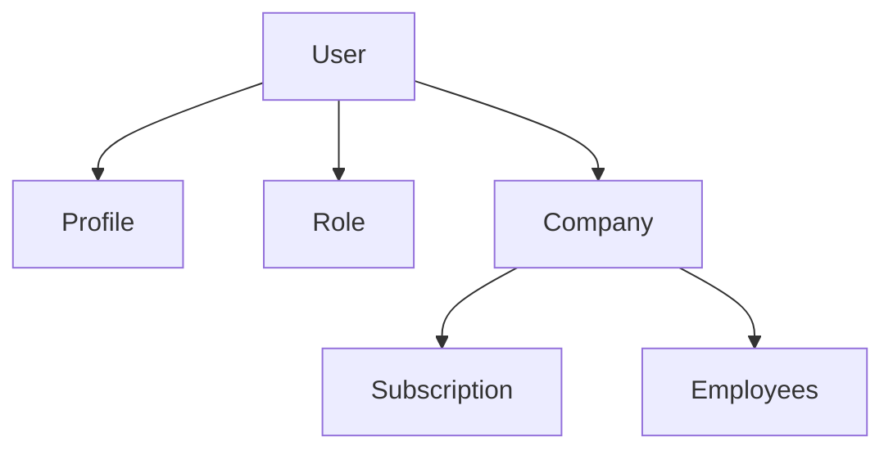
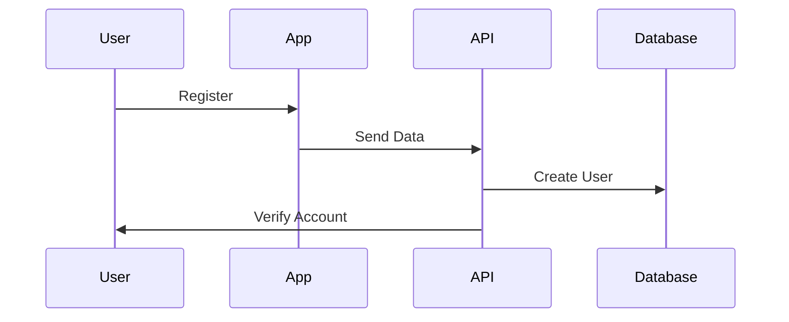
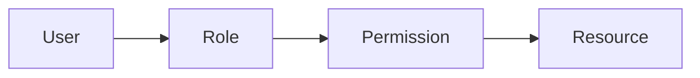
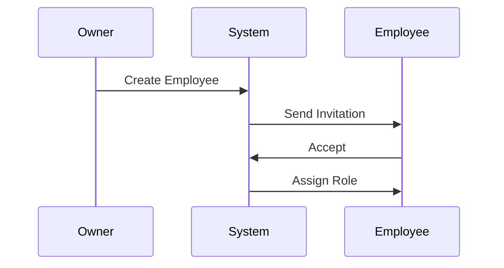

# Authentication & Identity Management

## 1. Overview

Furniture Platform foydalanuvchilarni xavfsiz aniqlash va boshqarish uchun zamonaviy authentication tizimidan foydalanadi.

Tizim quyidagilarni qo'llab-quvvatlashi kerak:

* Customer account;
* Business account;
* Employee account;
* Admin account;
* Multi-device access;
* Role based authorization.

---

# 2. Authentication Goals

Asosiy maqsadlar:

* foydalanuvchini ishonchli aniqlash;
* kompaniya ma'lumotlarini himoya qilish;
* turli rollarga mos ruxsat berish;
* xalqaro foydalanuvchilar uchun qulay login yaratish.

---

# 3. User Identity Model

Platformada foydalanuvchi va biznes alohida tushuncha sifatida saqlanadi.



---

# 4. Account Types

## 4.1 Customer Account

Oddiy mijoz.

Foydalanish:

* mahsulot ko'rish;
* AR ishlatish;
* buyurtma berish.

---

## 4.2 Business Account

Mebel kompaniyasi.

Ichida:

* kompaniya profili;
* xodimlar;
* mahsulotlar;
* ERP ma'lumotlari.

---

## 4.3 Employee Account

Kompaniya tomonidan yaratiladi.

Misol:

* sotuvchi;
* dizayner;
* omborchi;
* montajchi.

---

## 4.4 Admin Account

Platforma boshqaruvi uchun.

---

# 5. Registration Flow

## Customer Registration



Kerakli ma'lumotlar:

* ism;
* telefon/email;
* password;
* davlat.

---

# 6. Business Registration

Mebel kompaniyasi uchun qo'shimcha ma'lumotlar:

* kompaniya nomi;
* faoliyat turi;
* manzil;
* telefon;
* soliq ma'lumotlari;
* portfolio;
* ishlab chiqarish yo'nalishi.

---

# 7. Verification System

Kompaniyalar uchun verification mavjud bo'ladi.

Bosqichlar:

```text
Pending

↓

Under Review

↓

Approved

↓

Rejected
```

---

# 8. Login Methods

Platforma quyidagilarni qo'llashi mumkin:

## Phone Authentication

Asosiy variant.

* SMS kod;
* OTP.

---

## Email Authentication

* email;
* password;
* verification.

---

## Social Login

Kelajakda:

* Google;
* Apple;
* boshqa OAuth providerlar.

---

# 9. Token System

API authentication uchun:

## Access Token

Qisqa muddatli token.

Vazifa:

* API so'rovlarini tasdiqlash.

---

## Refresh Token

Uzoq muddatli session.

Vazifa:

* foydalanuvchini qayta login qilmasdan davom ettirish.

---

# 10. Session Management

Tizim quyidagilarni saqlaydi:

* qurilma turi;
* login vaqti;
* IP;
* oxirgi faoliyat.

Misol:

```text
Device:
iPhone 16 Pro

Last Login:
2026-07-15

Status:
Active
```

---

# 11. Multi Device Support

Bir foydalanuvchi:

* telefon;
* planshet;
* kompyuter

orqali ishlashi mumkin.

Foydalanuvchi:

* faol sessiyalarni ko'rishi;
* kerak bo'lsa chiqarishi

mumkin.

---

# 12. Authorization System

Authentication:

"Sen kimsan?"

Authorization:

"Sen nima qila olasan?"

---

Misol:

```text
User:
Employee

Permission:
VIEW_ORDER

Result:
Allowed
```

---

# 13. Role Based Access Control

RBAC modeli:



---

# 14. Company Isolation

Muhim qoida:

Bir kompaniya foydalanuvchisi boshqa kompaniya ma'lumotlariga kira olmaydi.

Misol:

```text
Company A Employee

CAN:
Company A Orders

CANNOT:
Company B Orders
```

---

# 15. Security Requirements

## Password Security

Talablar:

* kuchli password;
* hash qilish;
* brute force himoyasi.

---

## OTP Security

OTP:

* vaqt chegarasi;
* qayta yuborish limiti;
* urinish limiti.

---

## API Security

Himoya:

* rate limiting;
* request validation;
* permission check.

---

# 16. Account Recovery

Foydalanuvchi:

* password tiklash;
* telefon almashtirish;
* email yangilash

imkoniga ega bo'ladi.

---

# 17. Employee Invitation System

Kompaniya egasi xodim qo'shadi.

Jarayon:



---

# 18. Subscription Connection

Kompaniya accounti tarif bilan bog'lanadi.

Misol:

```text
Company:

Plan:
Professional

Users Limit:
20

AR Access:
Enabled
```

---

# 19. Audit Logs

Authentication hodisalari yoziladi:

* login;
* logout;
* password change;
* role change;
* failed attempts.

---

# 20. Future Authentication Features

Kelajakda:

* Face ID;
* biometric login;
* hardware security key;
* enterprise SSO.

---

# 21. Summary

Authentication tizimi:

* xavfsiz;
* kengayadigan;
* ko'p davlatli;
* ko'p kompaniyali

platforma yaratish uchun asosiy modul hisoblanadi.

U foydalanuvchilarni aniqlaydi va barcha boshqa modullar uchun xavfsiz kirish qatlamini beradi.
