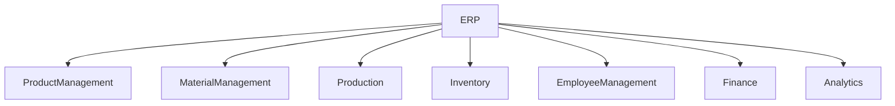
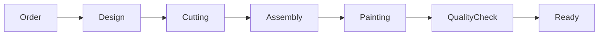

# ERP Module

## 1. Overview

Furniture Platform ERP moduli mebel ishlab chiqaruvchi kompaniyalarning ichki operatsiyalarini boshqarish uchun yaratiladi.

ERP platformaning eng asosiy B2B qismi hisoblanadi.

U quyidagi jarayonlarni yagona tizimga birlashtiradi:

* mahsulot boshqaruvi;
* xomashyo nazorati;
* ishlab chiqarish;
* ombor;
* xodimlar;
* xarajatlar;
* foyda tahlili.

---

# 2. ERP Main Goal

ERP modulining maqsadi:

> Mebel kompaniyasiga ishlab chiqarishdan sotuvgacha bo'lgan barcha jarayonlarni raqamlashtirish va real vaqt nazoratini berish.

---

# 3. ERP Architecture



---

# 4. Company Structure

Har bir kompaniya ichida:

```text
Company

├── Departments

├── Employees

├── Warehouses

├── Production Lines

├── Products

└── Orders
```

---

# 5. Product Management

## Purpose

Mebel mahsulotlarini boshqarish.

---

## Product Data

Mahsulot:

* nomi;
* kategoriya;
* rasmlar;
* 3D model;
* o'lcham;
* materiallar;
* narx;
* ishlab chiqarish vaqti.

---

## Product Example

```json
{
"name": "Modern Kitchen",
"type": "Kitchen",
"width": 3500,
"height": 2400,
"material": [
"MDF",
"Stone"
],
"3d_model": true
}
```

---

# 6. Product Variants

Bir mahsulot bir nechta variantga ega bo'lishi mumkin.

Misol:

```text
Kitchen Model A

Variants:

- White
- Black
- Wood
- Premium
```

Variantlar:

* rang;
* material;
* o'lcham;
* aksessuar

bo'yicha farqlanadi.

---

# 7. 3D Asset Management

AR uchun mahsulotlar 3D formatda saqlanadi.

Qo'llab-quvvatlash:

* USDZ (iOS)
* GLB/GLTF
* FBX

---

## 3D Metadata

Saqlanadi:

* model hajmi;
* real o'lcham;
* material mapping;
* texture.

---

# 8. Material Management

## Purpose

Xomashyoni nazorat qilish.

---

Material turlari:

* MDF;
* DSP;
* fanera;
* metall;
* shisha;
* furnitura;
* bo'yoq.

---

## Material Data

```text
Material

Name:
MDF White

Unit:
m2

Price:
...

Stock:
...
```

---

# 9. Bill of Materials (BOM)

BOM mahsulot tayyorlash uchun kerak bo'ladigan materiallar ro'yxati.

Misol:

```text
Kitchen Model A

Required:

MDF:
25 m2

Handle:
15 pcs

Hinge:
20 pcs
```

---

# 10. Production Management

Ishlab chiqarish bosqichlarini boshqarish.

---

## Production Flow



---

# 11. Production Status

Statuslar:

```text
New

↓

Confirmed

↓

Production Started

↓

Assembly

↓

Quality Control

↓

Ready

↓

Delivered
```

---

# 12. Employee Task Management

Har bir ishlab chiqarish bosqichi xodimga beriladi.

Misol:

```text
Task:

Kitchen Order #1024

Department:
Assembly

Employee:
Ali

Deadline:
Friday
```

---

# 13. Warehouse Management

## Main Functions

* kirim;
* chiqim;
* qoldiq;
* inventar.

---

## Warehouse Structure

```text
Main Warehouse

├── MDF Area

├── Hardware Area

├── Finished Products

└── Tools
```

---

# 14. QR Code Integration

Har bir:

* mahsulot;
* material;
* buyurtma

QR kodga ega bo'lishi mumkin.

---

## QR Usage

Misol:

Xodim mahsulot QR kodini skaner qiladi:

Natija:

* status;
* material;
* mas'ul shaxs;
* tarix.

---

# 15. Cost Calculation

Platforma ishlab chiqarish tannarxini hisoblaydi.

Formula:

```text
Total Cost =

Material Cost

+

Employee Cost

+

Additional Cost
```

---

# 16. Profit Calculation

Har bir buyurtma uchun:

```text
Profit =

Sale Price

-

Production Cost
```

---

# 17. Supplier Management

Kelajakda:

Material yetkazib beruvchilar ulanadi.

Saqlanadi:

* supplier;
* narx;
* yetkazish vaqti;
* tarix.

---

# 18. Production Analytics

Dashboard:

Ko'rsatadi:

* qancha buyurtma;
* ishlab chiqarish tezligi;
* xarajat;
* foyda;
* xodim samaradorligi.

---

# 19. Real-Time Monitoring

Kelajakda:

* kamera;
* skaner;
* elektron tarozi;
* ishlab chiqarish qurilmalari

integratsiyasi mumkin.

---

# 20. ERP Subscription Dependency

ERP funksiyalari tariflarga bog'lanadi.

Misol:

## Starter

* mahsulot;
* buyurtma.

## Professional

* ombor;
* ishlab chiqarish;
* xodimlar.

## Enterprise

* integratsiya;
* analitika;
* avtomatlashtirish.

---

# 21. ERP Security

Muhim himoya:

* kompaniya izolyatsiyasi;
* audit log;
* permission system.

---

# 22. Future ERP Features

Kelajakda:

* AI ishlab chiqarish rejalashtirish;
* avtomatik xarid tavsiyasi;
* talab prognozi;
* robot integratsiyasi.

---

# 23. Summary

ERP modul Furniture Platformning asosiy biznes qiymatini yaratadi.

U:

* ishlab chiqaruvchini boshqaradi;
* xarajatlarni kamaytiradi;
* mijozga shaffoflik beradi;
* marketplace bilan bog'lanadi.

ERP + Marketplace + AR kombinatsiyasi platformaning asosiy farqlovchi jihati hisoblanadi.
