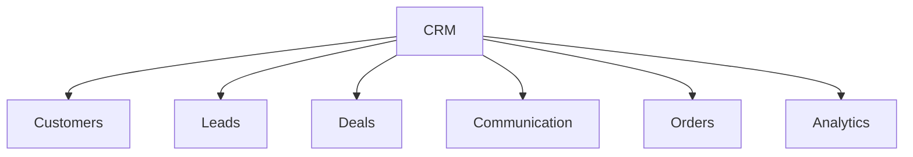
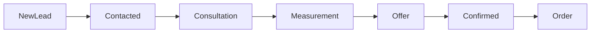
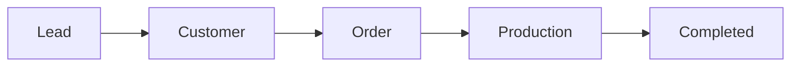

# CRM Module

## 1. Overview

Furniture Platform CRM moduli mebel kompaniyalari va mijozlar o'rtasidagi barcha aloqalarni boshqarish uchun yaratiladi.

CRM ERP bilan bog'langan holda ishlaydi.

Asosiy maqsad:

> Mijoz topishdan boshlab, buyurtma yakunlangunga qadar bo'lgan barcha jarayonlarni yagona tizimda boshqarish.

---

# 2. CRM Purpose

CRM quyidagi muammolarni hal qiladi:

* mijoz ma'lumotlarini yo'qotish;
* eski buyurtmalarni topish qiyinligi;
* sotuv jarayonining nazoratsizligi;
* mijoz bilan aloqa tarixining yo'qligi.

---

# 3. CRM Architecture



---

# 4. Customer Management

## Customer Profile

Har bir mijoz uchun:

* ism;
* telefon;
* email;
* manzil;
* xona ma'lumotlari;
* buyurtmalar tarixi;
* aloqa tarixi.

saqlanadi.

---

## Customer Example

```json id="6s0g9y"
{
"name": "Customer Name",
"phone": "+998XXXXXXXXX",
"city": "Tashkent",
"orders": [
1024,
1035
]
}
```

---

# 5. Lead Management

## Lead Definition

Lead — hali buyurtma bermagan, lekin qiziqish bildirgan mijoz.

Misollar:

* AR orqali model ko'rdi;
* narx so'radi;
* Instagramdan keldi;
* sayt orqali murojaat qildi.

---

# Lead Sources

```text id="yx2k5p"
Website

Instagram

Marketplace

AR Application

Phone

Employee Referral
```

---

# 6. Sales Pipeline

CRM sotuv jarayonini bosqichlarga ajratadi.



---

# 7. Deal Management

Deal — mijoz bilan amalga oshirilayotgan savdo jarayoni.

Saqlanadi:

* mahsulot;
* taxminiy narx;
* mas'ul xodim;
* muddat;
* status.

---

# 8. Customer Journey

To'liq jarayon:

```text id="0l5x5j"
Customer sees product

↓

Uses AR

↓

Requests consultation

↓

Employee contacts customer

↓

Measurement visit

↓

Price calculation

↓

Order confirmation

↓

Production

↓

Delivery
```

---

# 9. Employee CRM Access

Turli xodimlar turli ko'rinishga ega bo'ladi.

---

## Sales Employee

Ko'radi:

* yangi mijozlar;
* leadlar;
* aloqa vazifalari.

---

## Designer

Ko'radi:

* xona;
* o'lcham;
* dizayn talablari.

---

## Manager

Ko'radi:

* umumiy sotuv;
* konversiya;
* xodim samaradorligi.

---

# 10. Communication History

CRM barcha aloqalarni saqlaydi.

Misollar:

* qo'ng'iroq;
* xabar;
* uchrashuv;
* taklif.

---

# 11. Reminder System

Xodimga eslatmalar:

Misol:

```text id="4klx6b"
Call customer

Date:
Tomorrow 10:00

Responsible:
Sales Manager
```

---

# 12. Customer Segmentation

Mijozlarni ajratish:

## By Status

* yangi;
* faol;
* doimiy;
* VIP.

---

## By Interest

* oshxona;
* shkaf;
* yotoqxona;
* ofis mebeli.

---

# 13. AR Integration

CRM va AR birgalikda ishlaydi.

Misol:

Mijoz AR orqali:

* oshxona modelini ko'rdi.

CRM avtomatik yaratadi:

```text
Lead:

Interest:
Kitchen

AR Model:
Kitchen Premium

Date:
Today
```

---

# 14. Order Conversion

CRM buyurtmaga o'tishni boshqaradi.



---

# 15. Analytics

CRM dashboard:

Ko'rsatadi:

* yangi leadlar;
* konversiya;
* sotuv hajmi;
* xodim natijasi;
* mijoz manbalari.

---

# 16. Marketing Integration

Kelajakda:

* Instagram;
* Telegram;
* Website;
* Advertisement platforms

bilan integratsiya.

---

# 17. AI CRM Features

Kelajakda AI:

* mijoz ehtimolini baholaydi;
* qaysi lead muhimligini aniqlaydi;
* tavsiya beradi.

Misol:

```text
Lead Score:

High

Reason:

Viewed 10 AR models

Requested price

Visited showroom
```

---

# 18. CRM Security

Qoidalar:

* xodim faqat o'z mijozlarini ko'rishi mumkin;
* kompaniya ma'lumotlari ajratiladi;
* barcha o'zgarishlar log qilinadi.

---

# 19. Future Features

Kelajakda:

* AI sales assistant;
* avtomatik javoblar;
* ovozli CRM;
* mijoz xulq tahlili.

---

# 20. Summary

CRM moduli Furniture Platformda mijoz va biznes o'rtasidagi asosiy bog'lovchi qatlamdir.

ERP ishlab chiqarishni boshqarsa, CRM sotuv va munosabatlarni boshqaradi.

Ikkalasi birga ishlaganda kompaniya:

* ko'proq mijoz topadi;
* buyurtmalarni nazorat qiladi;
* xizmat sifatini oshiradi.
