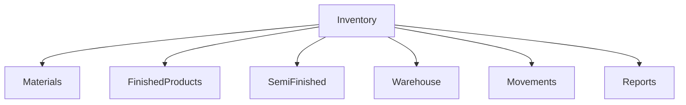
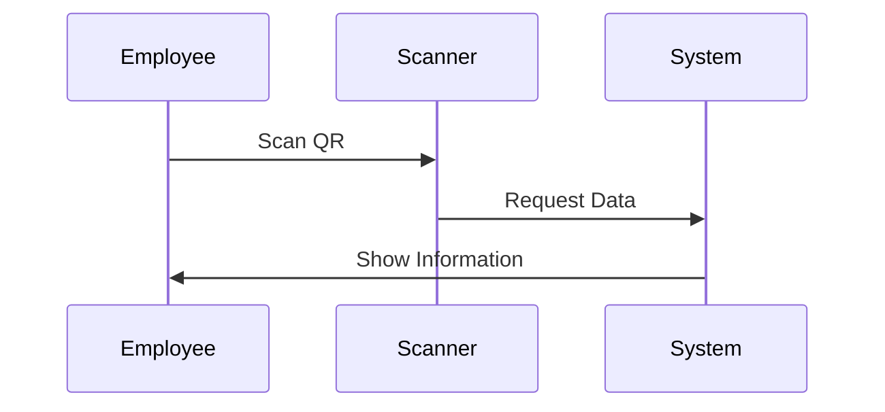
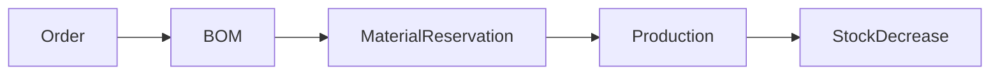

# Inventory Management Module

## 1. Overview

Inventory Management moduli Furniture Platform ERP tizimining asosiy qismlaridan biri hisoblanadi.

U mebel kompaniyasidagi barcha materiallar, tayyor mahsulotlar, yarim tayyor mahsulotlar va ombor harakatlarini boshqaradi.

Asosiy maqsad:

> Kompaniyaga real vaqt rejimida "nimasi bor, nimasi yetishmaydi va qayerga ishlatildi" degan savollarga javob berish.

---

# 2. Inventory Problems

Ko'p mebel korxonalarida:

* material qoldig'i aniq emas;
* ortiqcha xarid bo'ladi;
* material yo'qolishi kuzatiladi;
* ishlab chiqarish uchun nima kerakligi oldindan bilinmaydi.

Inventory moduli bu muammolarni kamaytiradi.

---

# 3. Inventory Architecture



---

# 4. Inventory Types

Platformada bir nechta inventar turi mavjud.

## 4.1 Raw Materials

Ishlab chiqarishda ishlatiladigan xomashyolar.

Misollar:

* MDF;
* DSP;
* yog'och;
* metall;
* shisha;
* furnitura;
* bo'yoq.

---

## 4.2 Semi Finished Products

Yarim tayyor mahsulotlar.

Misollar:

* kesilgan MDF;
* tayyorlangan karkas;
* bo'yalgan detal.

---

## 4.3 Finished Products

Tayyor mahsulotlar.

Misollar:

* oshxona komplekti;
* shkaf;
* stol;
* divan.

---

# 5. Warehouse Structure

Har bir kompaniyada bir nechta ombor bo'lishi mumkin.

Misol:

```text id="4pj8bs"
Company

├── Main Warehouse

├── Material Warehouse

├── Production Area

├── Finished Goods Warehouse

└── Delivery Area
```

---

# 6. Material Data Model

Har bir material uchun:

* nom;
* kategoriya;
* birlik;
* narx;
* miqdor;
* supplier;
* minimal limit.

saqlanadi.

---

## Example

```json id="r9js3n"
{
"name": "MDF White",
"unit": "m2",
"stock": 250,
"minimum_stock": 50
}
```

---

# 7. Stock Movement

Har bir harakat yozib boriladi.

Turlari:

## Incoming

Material kelishi.

Misol:

```text id="u7h8m1"
Supplier

+

100 sheets MDF
```

---

## Outgoing

Ishlab chiqarishga berish.

Misol:

```text id="1ydh5n"
Production Order

-

20 sheets MDF
```

---

## Transfer

Omborlar orasida o'tkazish.

---

# 8. QR Code System

Inventory QR orqali boshqarilishi mumkin.

QR beriladi:

* material;
* mahsulot;
* buyurtma;
* qutilar.

---

## QR Flow



---

# 9. Material Reservation

Ishlab chiqarish boshlanganda material band qilinadi.

Misol:

Buyurtma:

Kitchen Premium

Kerak:

* MDF 30 m2
* Handle 20 dona

Tizim:

```text id="8s6r3k"
Available:
100 MDF

Reserved:
30 MDF

Free:
70 MDF
```

---

# 10. Automatic Stock Update

Jarayon:



---

# 11. Low Stock Alert

Agar material kamayib ketsa:

Tizim ogohlantiradi.

Misol:

```text id="xk8m0f"
Warning:

MDF White

Current:
15 m2

Minimum:
50 m2
```

---

# 12. Supplier Integration

Kelajakda:

Material yetkazib beruvchilar platformaga ulanadi.

Imkoniyatlar:

* narx ko'rish;
* buyurtma berish;
* yetkazish kuzatuvi.

---

# 13. Inventory Analytics

Dashboard:

Ko'rsatadi:

* umumiy material qiymati;
* eng ko'p ishlatilayotgan material;
* yo'qotishlar;
* xarid tarixi.

---

# 14. Inventory Cost Calculation

Material tannarxi:

Formula:

```text id="4v0zv7"
Material Cost =

Quantity × Unit Price
```

---

# 15. Multi Warehouse Support

Yirik kompaniyalar uchun:

* bir nechta filial;
* bir nechta ombor;
* markaziy nazorat.

---

# 16. Employee Permissions

## Warehouse Employee

Ruxsat:

* material qabul qilish;
* chiqarish;
* inventar tekshirish.

---

## Manager

Ruxsat:

* hisobot;
* tasdiqlash;
* limit sozlash.

---

# 17. Audit System

Har bir operatsiya yoziladi.

Misol:

```text id="i8b6d9"
User:
Warehouse Worker

Action:
Removed MDF

Quantity:
10 m2

Time:
12:30
```

---

# 18. Real-Time Manufacturing Integration

Kelajakda:

* elektron tarozi;
* barcode scanner;
* ishlab chiqarish uskunalari

bilan bog'lanadi.

---

# 19. AI Inventory Features

Kelajakda AI:

* material talabini prognoz qiladi;
* ortiqcha zaxirani aniqlaydi;
* xarid tavsiya qiladi.

---

# 20. Future Expansion

Qo'shilishi mumkin:

* supplier marketplace;
* avtomatik procurement;
* smart warehouse;
* robot ombor integratsiyasi.

---

# 21. Summary

Inventory Management moduli Furniture Platformga quyidagilarni beradi:

* aniq material nazorati;
* ishlab chiqarish uchun tayyor ma'lumot;
* xarajatlarni kamaytirish;
* yo'qotishlarni kamaytirish.

ERP ichida Inventory ishlab chiqarish va moliyaviy tahlil uchun asosiy ma'lumot manbai bo'ladi.
