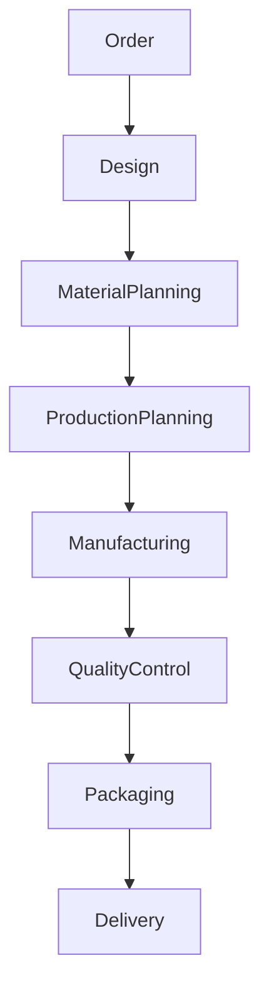
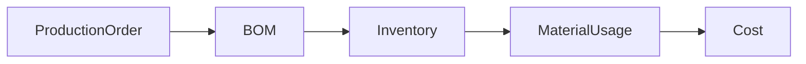

# Production Management Module

## 1. Overview

Production Management moduli Furniture Platform ERP tizimining ishlab chiqarish markazi hisoblanadi.

U buyurtma qabul qilingandan boshlab tayyor mahsulot mijozga yetkazilgunga qadar bo'lgan barcha jarayonlarni boshqaradi.

Asosiy maqsad:

> Mebel ishlab chiqarish jarayonini shaffof, nazorat qilinadigan va o'lchanadigan tizimga aylantirish.

---

# 2. Production Problems

Ko'p mebel korxonalarida:

* buyurtma qaysi bosqichdaligi noma'lum;
* xodim vazifalari aniq emas;
* muddat nazorati qiyin;
* material sarfi kuzatilmaydi;
* mijozga aniq ma'lumot berish qiyin.

Production Management bu muammolarni hal qiladi.

---

# 3. Production Architecture



---

# 4. Production Workflow

Asosiy jarayon:

```text id="9j7d0w"
New Order

↓

Design Approved

↓

Material Reserved

↓

Production Started

↓

Manufacturing

↓

Quality Check

↓

Ready For Delivery

↓

Delivered
```

---

# 5. Production Order

Har bir buyurtma uchun alohida Production Order yaratiladi.

Saqlanadi:

* buyurtma raqami;
* mahsulot;
* mijoz;
* materiallar;
* mas'ul xodimlar;
* deadline;
* status.

---

## Example

```json id="1x2r4m"
{
"order_id":1024,
"product":"Kitchen Premium",
"status":"production",
"deadline":"2026-08-01"
}
```

---

# 6. Manufacturing Stages

Har bir kompaniya o'z bosqichlarini sozlashi mumkin.

Standart:

## Stage 1: Design

* o'lcham;
* chizma;
* material tanlash.

---

## Stage 2: Cutting

* material kesish;
* detal tayyorlash.

---

## Stage 3: Assembly

* yig'ish;
* konstruksiya tekshirish.

---

## Stage 4: Finishing

* bo'yash;
* qoplama;
* dekor.

---

## Stage 5: Quality Control

* sifat tekshiruvi;
* kamchiliklarni aniqlash.

---

# 7. Employee Task System

Har bir bosqich vazifaga aylantiriladi.

Misol:

```text id="1a4n8p"
Task:

Cut Kitchen Panels

Responsible:
Ali

Deadline:
Tomorrow

Status:
Pending
```

---

# 8. Employee Workflow

Xodim mobil ilovadan:

* vazifalarni ko'radi;
* boshlaydi;
* tugatadi;
* rasm yuklaydi;
* izoh qoldiradi.

---

# 9. Production Status Tracking

Statuslar:

```text id="v7b9x2"
WAITING

↓

IN_PROGRESS

↓

PAUSED

↓

QUALITY_CHECK

↓

COMPLETED
```

---

# 10. Customer Status Integration

Production status mijozga ko'rsatilishi mumkin.

Masalan:

Mijoz ko'radi:

```text id="m5q0d1"
Your Furniture:

✓ Design Completed

✓ Materials Prepared

✓ Production Started

○ Delivery Pending
```

---

# 11. Material Integration

Production Inventory bilan bog'lanadi.

Jarayon:



---

# 12. Bill of Materials Integration

Har bir mahsulot uchun:

* kerakli material;
* miqdor;
* xarajat

aniqlanadi.

---

# 13. Production Planning

Manager:

* yangi buyurtmalar;
* ishlab chiqarish quvvati;
* xodim bandligi

asosida reja tuzadi.

---

# 14. Capacity Management

Tizim ko'rsatadi:

Misol:

```text id="f9k2l0"
Production Capacity:

Current:
85%

Available:
15%
```

---

# 15. Deadline Management

Agar kechikish xavfi bo'lsa:

Tizim ogohlantiradi.

Misol:

```text id="e7h3q8"
Warning:

Order #1024

Expected delay:
2 days
```

---

# 16. Quality Control

Sifat tekshiruvi:

Saqlanadi:

* tekshiruvchi;
* vaqt;
* natija;
* rasm;
* izoh.

---

# 17. Production Analytics

Dashboard:

Ko'rsatadi:

* ishlab chiqarilgan mahsulotlar;
* o'rtacha vaqt;
* kechikishlar;
* xodim samaradorligi.

---

# 18. QR Tracking Integration

Har bir ishlab chiqarish buyurtmasiga QR beriladi.

QR orqali:

* status;
* material;
* mas'ul xodim;
* tarix

ko'riladi.

---

# 19. Real-Time Factory Monitoring

Kelajakda:

Integratsiyalar:

* kamera;
* IoT qurilmalar;
* sensorlar;
* elektron tarozi.

---

# 20. AI Production Features

Kelajakda AI:

* ishlab chiqarish vaqtini taxmin qiladi;
* optimal reja beradi;
* kechikishlarni oldindan aniqlaydi.

---

# 21. Custom Furniture Support

Mebel biznesining asosiy xususiyati:

Har bir buyurtma individual bo'lishi mumkin.

Shuning uchun tizim:

* maxsus o'lcham;
* maxsus material;
* maxsus dizayn

ni qo'llab-quvvatlaydi.

---

# 22. Multi Company Support

Har bir kompaniya:

* o'z ishlab chiqarish jarayonini;
* o'z statuslarini;
* o'z xodimlarini

sozlay oladi.

---

# 23. Security

Nazorat:

* kim status o'zgartirdi;
* kim material ishlatdi;
* kim buyurtmani tasdiqladi.

---

# 24. Future Features

Kelajak:

* AI production planner;
* robot ishlab chiqarish integratsiyasi;
* avtomatik CNC boshqaruvi;
* digital twin factory.

---

# 25. Summary

Production Management moduli Furniture Platformning asosiy qiymat yaratadigan qismlaridan biri.

U:

* ishlab chiqaruvchiga nazorat;
* xodimga aniq vazifa;
* mijozga shaffoflik

beradi.

Natijada mebel ishlab chiqarish jarayoni raqamli va boshqariladigan tizimga aylanadi.
