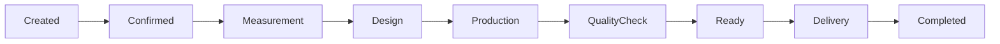

# Order Tracking Module

## 1. Overview

Order Tracking moduli Furniture Platformning mijoz, ishlab chiqaruvchi va xodimlar o'rtasidagi asosiy bog'lovchi tizimidir.

U buyurtma yaratilgan vaqtdan boshlab mijozga yetkazib berilgunga qadar bo'lgan barcha jarayonlarni kuzatadi.

Asosiy maqsad:

> Mijozga buyurtmasi qayerda ekanligini aniq ko'rsatish va ishlab chiqaruvchi uchun to'liq nazorat yaratish.

---

# 2. Problem Statement

Mebel sohasidagi asosiy muammolardan biri:

"Mening mebelim nima bo'ldi?"

Mijoz ko'pincha:

* qachon boshlanishini bilmaydi;
* kim tayyorlayotganini bilmaydi;
* kechikish sababini bilmaydi;
* ustaga qayta-qayta yozishga majbur bo'ladi.

Order Tracking bu muammoni hal qiladi.

---

# 3. Order Lifecycle



---

# 4. Order Creation

Buyurtma quyidagi manbalardan kelishi mumkin:

* Marketplace;
* kompaniya CRM;
* xodim mobil ilovasi;
* mijozning o'zi.

---

## Order Data

Saqlanadi:

* buyurtma raqami;
* mijoz;
* mahsulot;
* konfiguratsiya;
* narx;
* muddat;
* kompaniya;
* mas'ullar.

---

# 5. Order Status System

Standart statuslar:

## New

Buyurtma yaratildi.

---

## Confirmed

Kompaniya buyurtmani qabul qildi.

---

## Measurement

O'lchov olish jarayoni.

Misol:

* xona o'lchami;
* rasmlar;
* izohlar.

---

## Design

Dizayn tayyorlanmoqda.

Saqlanadi:

* chizma;
* 3D model;
* variantlar.

---

## Production

Ishlab chiqarish boshlandi.

---

## Quality Check

Mahsulot tekshirilmoqda.

---

## Ready

Mahsulot tayyor.

---

## Delivery

Yetkazib berish jarayoni.

---

## Completed

Buyurtma yakunlandi.

---

# 6. Customer View

Mijoz oddiy ko'rinishda jarayonni ko'radi.

Misol:

```text id="1v0x3p"
Kitchen Order #1024

✓ Order Accepted

✓ Measurement Completed

✓ Design Approved

✓ Production Started

○ Delivery
```

---

# 7. Company View

Kompaniya batafsil ma'lumot ko'radi:

* xodimlar;
* material;
* xarajat;
* deadline;
* ichki status.

---

# 8. Employee View

Xodim ko'radi:

* unga berilgan vazifalar;
* manzil;
* vaqt;
* mijoz ma'lumotlari.

---

# 9. Custom Status System

Har bir kompaniya o'z statuslarini yaratishi mumkin.

Misol:

```text id="k6m8q2"
Company A:

Cutting

Painting

Assembly

Packing
```

---

# 10. Deadline Management

Har bir buyurtmada:

* rejalashtirilgan sana;
* haqiqiy sana;
* kechikish sababi

saqlanadi.

---

# 11. Delay Notification

Agar kechikish bo'lsa:

Mijozga:

> "Buyurtmangiz ishlab chiqarish bosqichida. Taxminiy tayyor bo'lish sanasi yangilandi."

xabar yuboriladi.

---

# 12. Real-Time Updates

Yangilanishlar:

* WebSocket;
* Push notification;
* Email;
* Telegram

orqali yuborilishi mumkin.

---

# 13. Order Documents

Buyurtmaga bog'lanadi:

* shartnoma;
* dizayn;
* hisob-faktura;
* rasmlar;
* o'lchov fayllari.

---

# 14. Payment Integration

Kelajakda:

To'lov bosqichlari:

```text id="4t0f8s"
Deposit

↓

Production Payment

↓

Final Payment
```

---

# 15. AR Integration

Buyurtma AR bilan bog'lanadi.

Misol:

Mijoz:

* aynan o'z buyurtmasidagi mebelni;
* o'z xonasida;
* tayyor holatga yaqin

ko'rishi mumkin.

---

# 16. Order History

Har bir mijoz uchun:

* eski buyurtmalar;
* mahsulotlar;
* kompaniyalar;
* xarid tarixi

saqlanadi.

---

# 17. Rating & Feedback

Buyurtma tugagach:

Mijoz:

* baho;
* sharh;
* rasm

qoldirishi mumkin.

---

# 18. Order Analytics

Kompaniya ko'radi:

* o'rtacha tayyorlash vaqti;
* kechikish foizi;
* eng ko'p sotiladigan mahsulot;
* mijoz qoniqishi.

---

# 19. Order Security

Muhim qoidalar:

* mijoz faqat o'z buyurtmasini ko'radi;
* kompaniya faqat o'z buyurtmalariga ega;
* har bir o'zgarish log qilinadi.

---

# 20. Future Features

Kelajak:

* AI delay prediction;
* avtomatik mijoz xabarlari;
* logistika optimizatsiyasi;
* delivery tracking.

---

# 21. Summary

Order Tracking moduli Furniture Platformning ishonch yaratadigan qismidir.

U:

* mijoz savolini kamaytiradi;
* ustaga tushadigan aloqa yukini kamaytiradi;
* biznes jarayonini professional ko'rinishga olib keladi.

Platformaning asosiy farqi:

> Mijoz faqat mebel sotib olmaydi, balki butun jarayonni ko'rib turadi.
