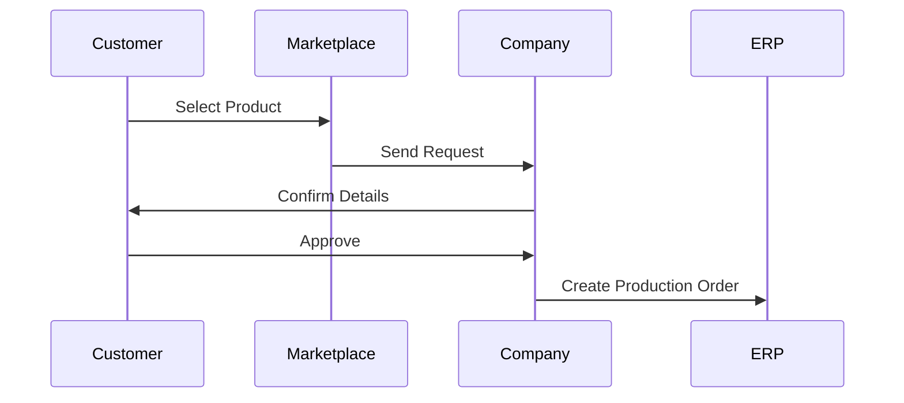
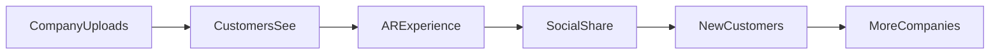

# Marketplace Module

## 1. Overview

Marketplace moduli Furniture Platformning B2C qismi hisoblanadi.

U turli mebel ishlab chiqaruvchilar, dizaynerlar va xizmat ko'rsatuvchilarni yagona raqamli ekotizimga birlashtiradi.

Asosiy maqsad:

> Mijozga kerakli mebelni topish, AR orqali ko'rish, narxni taxmin qilish va ishonchli ishlab chiqaruvchidan buyurtma qilish imkoniyatini berish.

---

# 2. Marketplace Vision

An'anaviy model:

```text
Customer

↓

Searches different shops

↓

Calls seller

↓

Waits for information
```

Platforma modeli:

```text
Customer

↓

Furniture Platform

↓

Hundreds of verified companies

↓

AR Preview

↓

Order
```

---

# 3. Marketplace Participants

Marketplace ichida:

## Furniture Companies

Mahsulotlarini joylashtiradi.

---

## Customers

Mahsulot tanlaydi va buyurtma beradi.

---

## Service Providers

Kelajakda:

* oboychilar;
* derazachilar;
* interyer dizaynerlar;
* montajchilar.

---

# 4. Product Catalog

Har bir mahsulot quyidagi ma'lumotlarga ega:

* nom;
* kategoriya;
* kompaniya;
* rasmlar;
* 3D model;
* material;
* o'lcham;
* narx diapazoni;
* ishlab chiqarish vaqti.

---

# 5. Furniture Categories

Standart kategoriyalar:

```text id="q7x9mw"
Kitchen

Wardrobe

Bedroom

Living Room

Office

Table

Chair

Sofa

Custom Furniture
```

---

# 6. Product Configuration

Mebel ko'pincha individual bo'ladi.

Shuning uchun konfigurator bo'ladi.

Mijoz o'zgartira oladi:

* rang;
* material;
* o'lcham;
* furnitura;
* qo'shimcha elementlar.

---

# 7. Dynamic Pricing

Platforma taxminiy narx chiqaradi.

Formula:

```text id="9f8k3v"
Estimated Price =

Base Product

+

Material Changes

+

Size Changes

+

Additional Options
```

---

Misol:

Standart oshxona:

$1500

O'zgarish:

* premium MDF;
* uzunlik +1 metr;
* yangi furnitura.

Natija:

Taxminiy:

$2200 - $2500

---

# 8. AR Product Preview

Marketplace asosiy farqi:

Oddiy rasm o'rniga:

* real xona;
* real o'lcham;
* real joylashuv.

---

AR imkoniyatlari:

* mebelni joylashtirish;
* aylantirish;
* rang almashtirish;
* variant solishtirish.

---

# 9. Free & Premium AR Model

## Free User

Ruxsat:

* 1 ta model ko'rish.

---

## Premium User

Ruxsat:

* ko'p model;
* dizayn saqlash;
* xona variantlari;
* taqqoslash.

---

# 10. Company Profile

Har bir mebelchi uchun sahifa:

Ko'rsatiladi:

* kompaniya nomi;
* portfolio;
* mahsulotlar;
* reyting;
* ish tajribasi;
* joylashuv.

---

# 11. Verification System

Sifat nazorati uchun:

Statuslar:

```text id="v7q2mx"
Pending

↓

Verified

↓

Premium Verified
```

---

# 12. Search System

Qidiruv:

## By Category

Misol:

"Oshxona"

---

## By Location

Misol:

"Toshkent"

---

## By Price

Narx oralig'i.

---

## By Style

* modern;
* classic;
* minimal;
* luxury.

---

# 13. Location Based Marketplace

Muhim funksiya:

Mijozga yaqin ustalarni ko'rsatish.

Misol:

```text id="x8k1p4"
Customer Location:

Tashkent

Results:

15 Furniture Companies
within 10 km
```

---

# 14. Order Flow



---

# 15. Marketplace Commission

Platform daromadi:

Variantlar:

## Commission

Har bir buyurtmadan foiz.

---

## Subscription

Mebelchi oylik to'lov qiladi.

---

## Featured Listing

Premium ko'rinish.

---

# 16. Rating System

Mijoz baholaydi:

* sifat;
* vaqt;
* aloqa;
* narx.

---

# 17. Review Protection

Soxta sharhlarga qarshi:

* faqat haqiqiy buyurtma qilgan mijoz yozadi;
* buyurtma bilan bog'lanadi.

---

# 18. Multi Country Marketplace

Har bir davlat:

* o'z kompaniyalari;
* tili;
* valyutasi;
* qoidalari

bilan ishlaydi.

Misol:

```json id="6q5m1w"
{
"country":"Kazakhstan",
"currency":"KZT",
"language":"kk",
"orders_enabled":false
}
```

---

# 19. Cross Country Demo Mode

Yangi davlat foydalanuvchisi kirsa:

Agar lokal ustalar bo'lmasa:

Ko'rsatiladi:

```text
Sizning hududingizda
ro'yxatdan o'tgan ustaxonalar yo'q.

Demo rejimda boshqa davlat
mahsulotlarini ko'rishingiz mumkin.
```

---

# 20. Marketplace Growth Loop



---

# 21. Future Expansion

Marketplace kengayishi:

Furniture →

Interior →

Construction Services →

Smart Home

---

# 22. Summary

Marketplace moduli:

* mebelchilarni birlashtiradi;
* mijoz uchun tanlov yaratadi;
* AR orqali farq yaratadi;
* ERP orqali sifatni nazorat qiladi.

Asosiy strategik qiymat:

> Platforma faqat katalog emas, balki ishlab chiqaruvchi + mijoz + xizmatlar ekotizimiga aylanadi.
