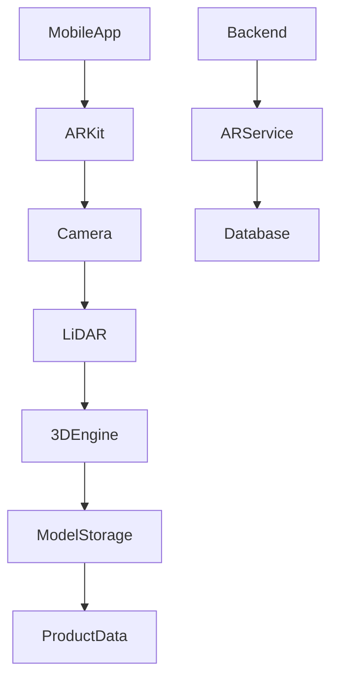
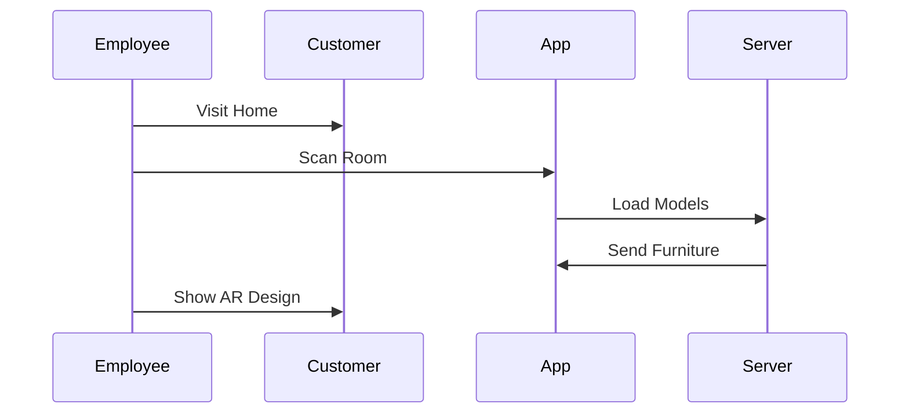

# AR System Module

## 1. Overview

AR (Augmented Reality) tizimi Furniture Platformning eng katta farqlovchi texnologik qismlaridan biri hisoblanadi.

U mijozga mebelni sotib olishdan oldin o'z uyida qanday ko'rinishini ko'rish imkonini beradi.

Asosiy maqsad:

> Mebel tanlash jarayonini oddiy rasm ko'rishdan real joylashtirish tajribasiga o'tkazish.

---

# 2. AR Business Value

Oddiy marketplace:

```text
Rasm

↓

Tasavvur qilish

↓

Sotib olish
```

Furniture Platform:

```text
Mahsulot

↓

AR orqali xona ichida ko'rish

↓

Variantlarni o'zgartirish

↓

Buyurtma
```

---

# 3. AR Users

AR ikki asosiy foydalanuvchi uchun ishlaydi:

## Customer AR

Mijoz o'zi ishlatadi.

---

## Employee AR

Xodim mijoz uyiga borib professional ko'rsatadi.

---

# 4. AR Architecture



---

# 5. Supported Platforms

## iOS

Asosiy platforma:

* ARKit;
* RealityKit;
* LiDAR Scanner.

Sabab:

* yuqori aniqlik;
* stabil tracking;
* premium foydalanuvchilar.

---

## Android

Kelajakda:

* ARCore;
* Depth API.

---

# 6. 3D Model Pipeline

Mebelchi mahsulotini yuklaydi:


---

# 7. Supported 3D Formats

Asosiy formatlar:

## USDZ

iOS uchun.

---

## GLB / GLTF

Universal format.

---

## FBX

Professional modellar uchun.

---

# 8. 3D Model Requirements

Har bir model:

* real o'lcham;
* to'g'ri koordinata;
* material;
* texture;
* collision data

ga ega bo'lishi kerak.

---

# 9. Product Metadata

Har bir 3D model bilan:

```json id="8a4m5x"
{
"name":"Kitchen Premium",
"width":3500,
"height":2400,
"depth":600,
"material":"MDF",
"price_range":"2000-3000"
}
```

saqlanadi.

---

# 10. AR Placement System

Foydalanuvchi:

* polni aniqlaydi;
* devorni aniqlaydi;
* mebel joylashtiradi.

---

# 11. Furniture Transformation

Mijoz:

* ko'chirish;
* aylantirish;
* o'lchamni ko'rish;
* rang almashtirish

imkoniga ega bo'ladi.

---

# 12. Room Scanning

LiDAR mavjud qurilmalarda:

Aniqlanadi:

* xona o'lchami;
* devorlar;
* pol;
* bo'sh joy.

---

# 13. Employee AR Workflow

Xodim jarayoni:



---

# 14. Measurement Integration

AR o'lchovlari CRM bilan bog'lanadi.

Saqlanadi:

* xona o'lchami;
* rasmlar;
* koordinatalar;
* izohlar.

---

# 15. Multiple Furniture Placement

Muhim funksiya:

Bir nechta mahsulotni birga ko'rish.

Misol:

* stol;
* stul;
* shkaf;
* divan.

---

# 16. Interior Package

Kelajakda:

Birgina mebel emas:

* oboy;
* pol;
* deraza;
* pardalar;
* yoritish

ham AR orqali ko'riladi.

---

# 17. AR Pricing Integration

AR konfiguratsiyasi narxga ta'sir qiladi.

Misol:

Mijoz:

Standart shkaf:

$1000

O'zgartirish:

* premium material

* katta o'lcham

Natija:

Taxminiy:

$1400

---

# 18. AR Analytics

Platforma kuzatadi:

* qaysi model ko'p ko'rildi;
* qaysi variant tanlandi;
* qaysi mahsulot sotildi.

---

# 19. AR Monetization

Daromad:

## Furniture Company

* AR premium paket;
* 3D model hosting.

---

## Customer

* premium AR;
* design save;
* multiple rooms.

---

# 20. 3D Model Protection

Mebelchilar uchun himoya:

* original faylni yashirish;
* serverdan streaming;
* watermark;
* access token.

---

# 21. AI + AR Future

Kelajak:

AI yordamida:

* xona dizayni;
* rang tavsiyasi;
* mebel joylashuvi;
* avtomatik konfiguratsiya.

---

# 22. Performance Requirements

Mobil qurilmada:

Maqsad:

* tez yuklanish;
* stabil FPS;
* optimallashtirilgan model.

---

# 23. AR Device Compatibility

Darajalar:

## Basic

Oddiy kamera.

---

## Advanced

Depth sensor.

---

## Professional

LiDAR.

---

# 24. Summary

AR System Furniture Platformning eng katta raqobat ustunligi bo'ladi.

U:

* mijoz ishonchini oshiradi;
* sotuvni tezlashtiradi;
* qaytarish ehtimolini kamaytiradi;
* mebelni raqamli tajribaga aylantiradi.

Platforma oddiy marketplace emas, balki **AR Commerce platformasi** sifatida rivojlanadi.
