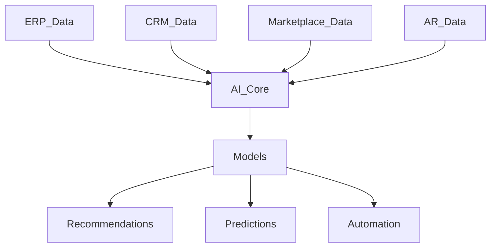
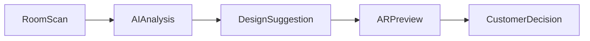

# AI System Module

## 1. Overview

AI System Furniture Platform ichidagi aqlli qatlam hisoblanadi.

U ERP, CRM, Marketplace va AR tizimlaridan keladigan ma'lumotlarni tahlil qilib, kompaniya va mijozlarga foydali tavsiyalar beradi.

Asosiy maqsad:

> Oddiy boshqaruv tizimini aqlli qaror qabul qiluvchi platformaga aylantirish.

---

# 2. AI Value Proposition

Oddiy tizim:

```text id="p2g7hx"
Data

↓

Report

↓

Human Decision
```

AI tizim:

```text id="8f4x0n"
Data

↓

AI Analysis

↓

Prediction

↓

Recommendation

↓

Decision
```

---

# 3. AI Architecture



---

# 4. AI Modules

Asosiy AI xizmatlari:

1. Smart Pricing
2. Design Assistant
3. Demand Prediction
4. Material Optimization
5. Customer Recommendation
6. Business Analytics AI

---

# 5. Smart Pricing AI

## Purpose

Mebel narxini tez va aniq taxmin qilish.

---

AI hisobga oladi:

* material;
* o'lcham;
* dizayn murakkabligi;
* ishlab chiqarish vaqti;
* ishchi xarajati;
* bozor narxi.

---

Formula:

```text id="d7j5mq"
Estimated Price =

Material Cost

+

Production Cost

+

Labor Cost

+

Market Adjustment
```

---

# 6. Dynamic Price Calculation

Misol:

Customer AR orqali:

Standart shkaf:

```text
Width:
2000mm

Material:
Premium MDF

Design:
Custom
```

AI:

```text
Estimated Price:

$1800-$2200
```

---

# 7. Design Assistant AI

AI mijozga dizayn tavsiya qiladi.

Input:

* xona rasmi;
* o'lcham;
* uslub;
* budjet.

Output:

* mebel tavsiyasi;
* rang;
* joylashuv.

---

# 8. AI + AR Integration

Jarayon:



---

# 9. Customer Recommendation System

Marketplace uchun.

AI tavsiya qiladi:

* mos mahsulot;
* mos kompaniya;
* narx oralig'i.

---

Misol:

Customer:

"kichik oshxona"

AI:

```text
Recommended:

Minimal Kitchen

Company A

Estimated:
$1500
```

---

# 10. Demand Prediction

Kompaniyaga yordam beradi.

AI taxmin qiladi:

* qaysi mahsulot ko'p sotiladi;
* qaysi material kerak bo'ladi;
* qaysi mavsumda talab oshadi.

---

# 11. Inventory AI

AI ombor ma'lumotidan foydalanadi.

Misol:

```text id="9j2f4b"
MDF usage:

Last month:
500 m2

Prediction next month:
650 m2

Recommendation:
Order 700 m2
```

---

# 12. Production AI

AI ishlab chiqarishni optimallashtiradi.

Tahlil:

* xodim yuklamasi;
* deadline;
* mavjud resurs.

---

Natija:

```text
Order #1024

Recommended production date:

August 5
```

---

# 13. Business Intelligence AI

Rahbarga yordam beradi.

Savollar:

"Mening foydam nega kamaydi?"

AI javob:

```text
Reason:

Material cost increased 18%

Solution:

Change supplier or optimize material usage
```

---

# 14. Customer Support AI

Kelajakda:

AI yordamchi:

* mahsulot haqida javob beradi;
* narx tushuntiradi;
* buyurtma statusini aytadi.

---

# 15. AI Agent Concept

Har bir kompaniya uchun:

Virtual biznes yordamchi.

Misol:

```text
Owner:

"Bu oy qanday natija bo'ldi?"

AI:

Sales increased 25%.
Main growth:
Kitchen category.
Recommended:
Increase MDF stock.
```

---

# 16. AI Data Sources

AI foydalanadigan ma'lumotlar:

## ERP

* ishlab chiqarish;
* xarajat;
* material.

---

## CRM

* mijoz;
* savdo;
* murojaatlar.

---

## Marketplace

* ko'rishlar;
* buyurtmalar;
* trendlar.

---

## AR

* ko'rilgan mahsulot;
* tanlangan variantlar.

---

# 17. AI Privacy

Muhim qoidalar:

* kompaniya ma'lumotlari ajratiladi;
* boshqa kompaniya ma'lumotlari ko'rinmaydi;
* anonim statistikadan foydalanish mumkin.

---

# 18. AI Model Strategy

Boshlanishida:

Oddiy algoritmlar:

* regression;
* recommendation;
* analytics.

Keyinchalik:

* machine learning;
* deep learning;
* LLM integration.

---

# 19. AI Infrastructure

Kelajak:

AI servis:

* alohida server;
* GPU;
* model storage;
* API orqali ishlaydi.

---

# 20. Future AI Features

Qo'shilishi mumkin:

* AI interior designer;
* AI sales manager;
* AI production planner;
* AI procurement manager;
* AI financial analyst.

---

# 21. Summary

AI System Furniture Platformni oddiy ERP va marketplace dan ajratib turadigan asosiy texnologik qatlamdir.

U:

* biznesga qaror beradi;
* mijozga yordam beradi;
* ishlab chiqarishni optimallashtiradi;
* platformaning qiymatini oshiradi.

Kelajakda platforma:

**ERP + Marketplace + AR + AI Business Assistant**

modeliga aylanadi.
