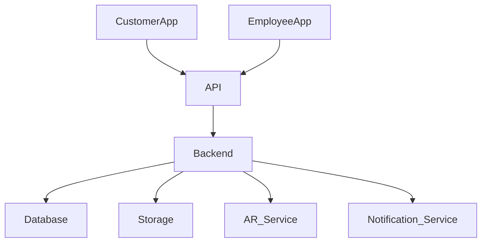
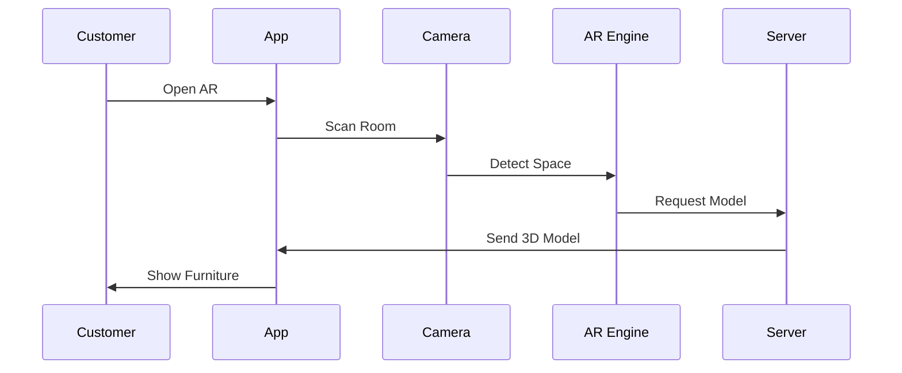

# Mobile Application Module

## 1. Overview

Furniture Platform mobil ekotizimi ikki asosiy yo'nalishga bo'linadi:

1. Customer Mobile App
2. Employee Mobile App

Mobil ilovaning asosiy vazifasi:

> Mebel tanlash, AR orqali ko'rish, buyurtma berish va biznes jarayonlarini joyidan boshqarish imkoniyatini yaratish.

---

# 2. Mobile Architecture



---

# 3. Customer Mobile Application

## 3.1 Purpose

Mijoz uchun raqamli showroom yaratish.

Mijoz:

* mebel topadi;
* AR orqali ko'radi;
* variantlarni o'zgartiradi;
* buyurtma beradi;
* jarayonni kuzatadi.

---

# 4. Customer App Features

## Home Screen

Ko'rsatiladi:

* tavsiya qilingan mahsulotlar;
* kategoriyalar;
* mashhur kompaniyalar;
* yangi kolleksiyalar.

---

# 5. Marketplace Browsing

Mijoz:

* kategoriya;
* narx;
* joylashuv;
* reyting;
* stil

bo'yicha qidiradi.

---

# 6. Product Detail Page

Mahsulot sahifasi:

* rasmlar;
* 3D model;
* material;
* o'lcham;
* taxminiy narx;
* ishlab chiqaruvchi.

---

# 7. AR Experience

Customer flow:



---

# 8. AR User Actions

Mijoz:

* joylashtirish;
* aylantirish;
* kattalashtirish;
* rang almashtirish;
* variant tanlash

mumkin.

---

# 9. Design Saving

Premium funksiyalar:

* xona saqlash;
* dizayn saqlash;
* keyin davom ettirish;
* do'stlar bilan ulashish.

---

# 10. Customer Order

Buyurtma jarayoni:

```text id="2w5r8n"
Select Product

↓

Configure

↓

Request Price

↓

Confirm Order

↓

Track Production

↓

Receive Product
```

---

# 11. Employee Mobile Application

## Purpose

Xodimlarni raqamli ish quroli bilan ta'minlash.

---

# 12. Employee App Roles

Qo'llab-quvvatlanadi:

* Sales employee;
* Designer;
* Measurement worker;
* Installer;
* Delivery worker;
* Manager.

---

# 13. Employee Dashboard

Ko'rsatiladi:

* bugungi vazifalar;
* tashriflar;
* buyurtmalar;
* mijozlar.

---

# 14. Customer Visit Workflow

Xodim mijoz uyiga boradi:


---

# 15. AR Sales Presentation

Xodim:

* mijoz xonasini skaner qiladi;
* mebel joylashtiradi;
* variantlarni ko'rsatadi;
* taxminiy narx beradi.

---

# 16. Measurement Module

Xodim:

* xona o'lchami;
* rasmlar;
* izohlar

kiritadi.

Ma'lumot avtomatik CRMga yuboriladi.

---

# 17. Offline Mode

Muhim imkoniyat.

Sabab:

Ba'zi joylarda internet bo'lmasligi mumkin.

Offline ishlashi:

* mijoz ma'lumotlari;
* tashrif;
* o'lchov;
* rasmlar.

Keyin:

```text id="9f6t3m"
Offline Data

↓

Internet Available

↓

Sync Server
```

---

# 18. Push Notification

Xodimga:

* yangi vazifa;
* yangi buyurtma;
* deadline.

Mijozga:

* status;
* tayyorlik;
* yetkazish.

---

# 19. Device Security

Mobil xavfsizlik:

* token authentication;
* biometric login;
* encrypted storage;
* remote logout.

---

# 20. iOS Priority Strategy

Birinchi bosqichda iOS ustuvor bo'lishi mumkin.

Sabab:

* ARKit kuchli;
* LiDAR mavjud;
* premium segment ko'p.

---

# 21. Android Support

Keyingi bosqich:

* ARCore;
* turli qurilmalar;
* kengroq bozor.

---

# 22. Mobile Technology Options

## iOS

Variantlar:

* Swift;
* SwiftUI;
* RealityKit;
* ARKit.

---

## Cross Platform

Variantlar:

* Flutter;
* React Native.

---

# 23. Mobile Analytics

Kuzatiladi:

* AR ishlatish soni;
* ko'rilgan mahsulot;
* buyurtmaga o'tish;
* ilova ishlashi.

---

# 24. Future Features

Kelajak:

* AI voice assistant;
* kamera orqali avtomatik dizayn;
* virtual showroom;
* Apple Vision Pro support.

---

# 25. Summary

Mobile Application platformaning foydalanuvchi bilan bevosita aloqa qatlami hisoblanadi.

Customer App:

* sotuv yaratadi.

Employee App:

* biznes jarayonlarini tezlashtiradi.

AR bilan birga mobil ilova Furniture Platformning asosiy raqobat ustunligini yaratadi.
