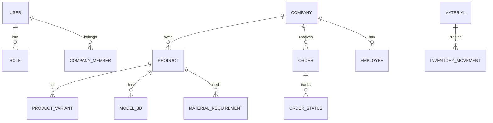

# Data Model Design

## 1. Overview

Furniture Platform katta ekotizim bo'lgani uchun ma'lumotlar modeli boshidan kengayadigan qilib loyihalanadi.

Asosiy talablar:

* ko'p kompaniya (multi-tenant);
* ko'p davlat;
* ERP;
* CRM;
* Marketplace;
* AR;
* AI ma'lumotlari.

---

# 2. Database Strategy

Asosiy database:

```text
PostgreSQL
```

Qo'shimcha:

* Redis — cache va real-time;
* Object Storage — rasmlar va 3D fayllar;
* Search Engine — katta katalog uchun.

---

# 3. Entity Relationship Overview



---

# 4. User Table

## users

Platformadagi barcha foydalanuvchilar.

Fields:

```text
id

phone

email

password_hash

first_name

last_name

country_id

created_at

updated_at
```

---

# 5. Role System

## roles

Foydalanuvchi huquqlari.

Misollar:

```text
CUSTOMER

COMPANY_OWNER

MANAGER

DESIGNER

WAREHOUSE_WORKER

ADMIN
```

---

## permissions

Aniq ruxsatlar.

Misol:

```text
CREATE_PRODUCT

VIEW_ORDER

MANAGE_STOCK
```

---

# 6. Country Model

## countries

Platformaning xalqaro ishlashi uchun.

Fields:

```text
id

name

code

currency

language

tax_rules

status
```

---

# 7. Company Model

## companies

Mebel korxonalari.

Fields:

```text
id

name

logo

description

country_id

address

phone

verification_status

subscription_plan
```

---

# 8. Company Members

## company_members

Xodim va kompaniya bog'lanishi.

Fields:

```text
id

company_id

user_id

role_id

status
```

---

# 9. Product Model

## products

Marketplace va ERP mahsulotlari.

Fields:

```text
id

company_id

category_id

name

description

base_price

status

created_at
```

---

# 10. Product Variant

## product_variants

Mahsulot variantlari.

Fields:

```text
id

product_id

color

material

size

price_modifier
```

---

Misol:

```text
Kitchen Premium

Variant:

Black MDF

+300$
```

---

# 11. 3D Model Storage

## product_models_3d

AR uchun.

Fields:

```text
id

product_id

file_url

format

size

version

status
```

---

# 12. Material Model

## materials

Xomashyo.

Fields:

```text
id

company_id

name

category

unit

price

supplier_id
```

---

# 13. Bill Of Materials

## product_materials

Mahsulot tarkibi.

Fields:

```text
id

product_id

material_id

quantity
```

---

Misol:

```text
Kitchen

MDF:
30 m2

Handle:
20 pcs
```

---

# 14. Inventory Model

## inventory

Ombor qoldig'i.

Fields:

```text
id

company_id

material_id

quantity

warehouse_id
```

---

# 15. Inventory Movement

## inventory_movements

Harakat tarixi.

Fields:

```text
id

inventory_id

type

quantity

user_id

created_at
```

---

# 16. Customer Model

## customers

CRM mijozlari.

Fields:

```text
id

user_id

address

preferences

created_at
```

---

# 17. Lead Model

## leads

Sotuv boshlanishi.

Fields:

```text
id

customer_id

company_id

source

status

assigned_employee
```

---

# 18. Order Model

## orders

Asosiy buyurtma.

Fields:

```text
id

customer_id

company_id

product_id

price

status

deadline
```

---

# 19. Order Status History

## order_status_history

Buyurtma tarixi.

Fields:

```text
id

order_id

old_status

new_status

changed_by

created_at
```

---

# 20. Production Model

## production_orders

Ishlab chiqarish.

Fields:

```text
id

order_id

stage

assigned_employee

start_date

end_date
```

---

# 21. AR Session Model

## ar_sessions

AR ishlatilishi.

Fields:

```text
id

user_id

product_id

device

created_at
```

---

# 22. Room Scan Model

## room_scans

Xona ma'lumotlari.

Fields:

```text
id

user_id

dimensions

images

scan_data
```

---

# 23. Payment Model

## payments

To'lovlar.

Fields:

```text
id

order_id

amount

method

status
```

---

# 24. Subscription Model

## subscriptions

B2B tariflar.

Fields:

```text
id

company_id

plan

start_date

end_date

status
```

---

# 25. Analytics Data

AI uchun yig'iladigan ma'lumotlar:

* mahsulot ko'rish;
* AR ishlatish;
* buyurtma;
* sotuv;
* material sarfi.

---

# 26. Multi Tenant Strategy

Har bir asosiy jadvalda:

```text
company_id
```

bo'lishi kerak.

Sabab:

Bir kompaniya boshqa kompaniya ma'lumotlarini ko'rmaydi.

---

# 27. Data Security

Himoya:

* row level security;
* permission checks;
* encryption;
* audit logs.

---

# 28. Future Database Scaling

Boshlanish:

```text
Single PostgreSQL
```

Keyinchalik:

```text
Database Cluster

+

Read Replicas

+

Partitioning
```

---

# 29. Summary

Data Model Furniture Platformning barcha qismlarini bog'laydi:

* ERP;
* CRM;
* Marketplace;
* AR;
* AI.

To'g'ri loyihalangan database platformaning kelajakdagi millionlab foydalanuvchilar bilan ishlash imkoniyatini yaratadi.
