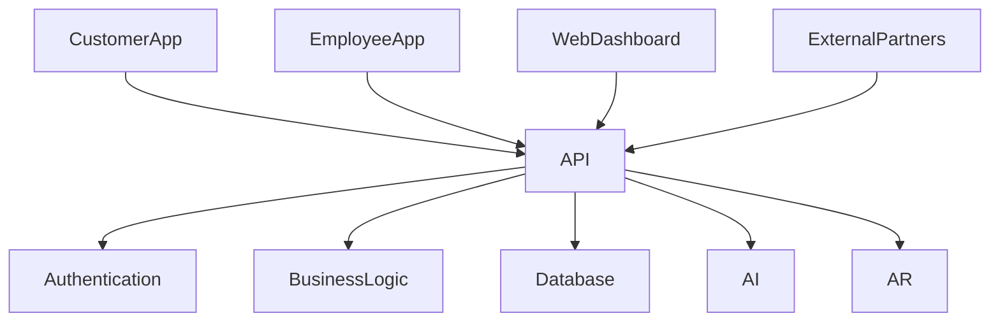

# API Design

## 1. Overview

Furniture Platform barcha client va servislar o'rtasida API orqali ishlaydi.

API asosiy bog'lovchi qatlam hisoblanadi:

* Mobile Application;
* Web Dashboard;
* ERP;
* CRM;
* Marketplace;
* AR Service;
* AI Service.

Asosiy maqsad:

> Barcha tizimlarni yagona standart orqali bog'lash va kelajakdagi integratsiyalar uchun ochiq arxitektura yaratish.

---

# 2. API Architecture



---

# 3. API Technology

Tavsiya:

## REST API

Asosiy operatsiyalar uchun:

* CRUD;
* mobil ilova;
* web dashboard.

---

## WebSocket

Real-time:

* order status;
* notification;
* production update.

---

## Future GraphQL

Katta marketplace uchun:

* murakkab qidiruv;
* optimallashtirilgan query.

---

# 4. API Versioning

API versiyalanadi.

Misol:

```text
/api/v1/
```

Kelajak:

```text
/api/v2/
```

Sabab:

Eski mobil ilovalarni buzmaslik.

---

# 5. Authentication API

## Register

```http
POST /api/v1/auth/register
```

Request:

```json id="3r7x2k"
{
"phone":"+998901234567",
"password":"password"
}
```

---

## Login

```http
POST /api/v1/auth/login
```

Response:

```json id="0o8p3n"
{
"access_token":"token",
"refresh_token":"token"
}
```

---

## Refresh Token

```http
POST /api/v1/auth/refresh
```

---

# 6. User API

## Get Profile

```http
GET /api/v1/users/profile
```

---

## Update Profile

```http
PATCH /api/v1/users/profile
```

---

# 7. Company API

## Create Company

```http
POST /api/v1/companies
```

---

## Company Profile

```http
GET /api/v1/companies/{id}
```

---

## Employees

```http
GET /api/v1/companies/{id}/employees
```

---

# 8. Product API

## Product List

```http
GET /api/v1/products
```

Filter:

```text
category

location

price

style
```

---

## Product Detail

```http
GET /api/v1/products/{id}
```

---

## Create Product

```http
POST /api/v1/products
```

Faqat:

* company owner;
* designer.

---

# 9. 3D Model API

## Upload Model

```http
POST /api/v1/products/{id}/3d-model
```

---

## Get AR Model

```http
GET /api/v1/products/{id}/ar-model
```

---

# 10. AR API

## Create AR Session

```http
POST /api/v1/ar/session
```

Request:

```json id="s6v2kq"
{
"product_id":1024,
"room_id":55
}
```

---

## Save Design

```http
POST /api/v1/ar/design/save
```

---

# 11. Customer API

## Customer Orders

```http
GET /api/v1/customer/orders
```

---

## Create Request

```http
POST /api/v1/customer/request
```

---

# 12. Order API

## Create Order

```http
POST /api/v1/orders
```

---

## Order Detail

```http
GET /api/v1/orders/{id}
```

---

## Update Status

```http
PATCH /api/v1/orders/{id}/status
```

---

# 13. Production API

## Production Tasks

```http
GET /api/v1/production/tasks
```

---

## Update Task

```http
PATCH /api/v1/production/tasks/{id}
```

---

# 14. Inventory API

## Stock List

```http
GET /api/v1/inventory
```

---

## Add Material

```http
POST /api/v1/inventory/material
```

---

## Stock Movement

```http
POST /api/v1/inventory/movement
```

---

# 15. CRM API

## Leads

```http
GET /api/v1/crm/leads
```

---

## Create Lead

```http
POST /api/v1/crm/leads
```

---

## Assign Employee

```http
PATCH /api/v1/crm/leads/{id}/assign
```

---

# 16. Search API

Marketplace qidiruvi:

```http
GET /api/v1/search
```

Parametrlar:

```text
query

category

location

price_range

style
```

---

# 17. Notification API

## Send Notification

```http
POST /api/v1/notifications/send
```

---

Kanallar:

* Push;
* SMS;
* Email;
* Telegram.

---

# 18. Payment API

## Create Payment

```http
POST /api/v1/payments
```

---

## Payment Status

```http
GET /api/v1/payments/{id}
```

---

# 19. AI API

AI servislar alohida API orqali ishlaydi.

---

## Price Prediction

```http
POST /api/v1/ai/price-prediction
```

Request:

```json id="5ks91a"
{
"material":"MDF",
"size":"3000x2500",
"style":"modern"
}
```

---

Response:

```json id="0o3x8v"
{
"min_price":2000,
"max_price":2500
}
```

---

# 20. External Integration API

Kelajakda:

* marketplace;
* supplier;
* payment provider;
* delivery service

uchun ochiq API.

---

# 21. API Security

Himoya:

* JWT;
* rate limiting;
* request validation;
* permission check;
* HTTPS.

---

# 22. API Documentation

Standart:

* OpenAPI;
* Swagger;
* Postman collection.

---

# 23. Error Format

Barcha xatolar bir xil formatda qaytadi.

Misol:

```json id="4d5f9a"
{
"success":false,
"error":{
"code":"PRODUCT_NOT_FOUND",
"message":"Product does not exist"
}
}
```

---

# 24. API Logging

Saqlanadi:

* request;
* response;
* user;
* timestamp;
* error.

---

# 25. Future API Gateway

Katta tizim uchun:

```text id="8s4n2v"
Mobile Apps

↓

API Gateway

↓

Microservices
```

---

# 26. Summary

API Design Furniture Platformning barcha qismlarini birlashtiruvchi asosiy texnik qatlamdir.

Yaxshi API:

* mobil ilovani;
* web tizimni;
* AI servislarni;
* hamkor platformalarni

bitta ekotizimga birlashtiradi.
