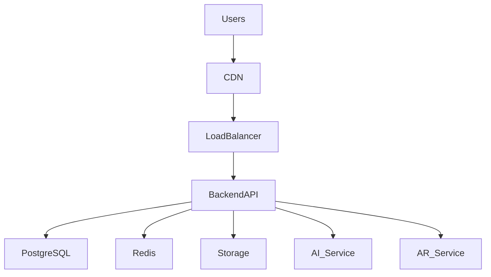
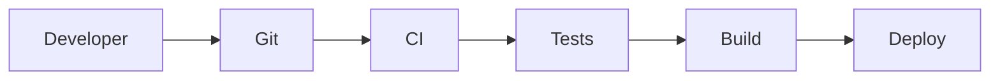

# Deployment Infrastructure Module

## 1. Overview

Furniture Platform katta ekotizim bo'lgani sababli server infratuzilmasi boshidanoq kengayadigan qilib loyihalanadi.

Tizim quyidagilarni qo'llab-quvvatlashi kerak:

* ko'p kompaniya;
* ko'p foydalanuvchi;
* katta 3D fayllar;
* AR so'rovlar;
* AI hisoblashlar;
* real-time monitoring.

Asosiy maqsad:

> Platformani MVP bosqichidan global darajadagi tizimgacha xavfsiz kengaytirish.

---

# 2. Infrastructure Architecture



---

# 3. Initial MVP Infrastructure

Boshlanish uchun:

```text id="6t8x2p"
Server

|

├── Backend API

├── PostgreSQL

├── Redis

├── Nginx

└── Storage
```

---

# 4. Production Architecture

Katta yuklama uchun:

```text id="w2h9mc"
Load Balancer

↓

API Servers

↓

Application Services

↓

Database Cluster

↓

Storage Cluster
```

---

# 5. Backend Deployment

Backend texnologiyalar:

Tavsiya:

* Django/FastAPI;
* PostgreSQL;
* Redis;
* Celery.

---

Deployment:

```text id="4f8v2k"
Code

↓

Docker Image

↓

Container

↓

Production Server
```

---

# 6. Docker Architecture

Har bir servis alohida container bo'lishi mumkin.

Misol:

```yaml id="2u8m4n"
services:

 backend:
   image: furniture-api

 database:
   image: postgres

 redis:
   image: redis

 nginx:
   image: nginx
```

---

# 7. Database Infrastructure

## PostgreSQL

Asosiy database.

Saqlaydi:

* user;
* company;
* orders;
* inventory;
* products.

---

## Scaling

Kelajakda:

```text id="7s0w3p"
Primary Database

↓

Read Replicas

↓

Analytics Database
```

---

# 8. Storage System

Katta fayllar uchun:

Saqlanadi:

* rasmlar;
* 3D modellar;
* AR fayllar;
* hujjatlar.

---

Variantlar:

* S3 compatible storage;
* Cloud Storage;
* Object Storage.

---

# 9. CDN Integration

AR va rasmlarni tez yuklash uchun.

Flow:

```text id="x6v1ma"
User

↓

CDN

↓

Storage
```

---

# 10. Redis Usage

Redis ishlatiladi:

## Cache

Tez-tez so'raladigan ma'lumotlar.

---

## Session

Foydalanuvchi sessiyalari.

---

## Queue

Fon vazifalari:

* AI processing;
* 3D optimization;
* notification.

---

# 11. Background Workers

Og'ir vazifalar asosiy serverni band qilmasligi kerak.

Misol:

```text id="9k2f6s"
Upload 3D Model

↓

Queue

↓

Worker

↓

Optimization

↓

Ready
```

---

# 12. AI Infrastructure

AI alohida servis sifatida ishlaydi.

Arxitektura:

```text id="p7m2xa"
Backend

↓

AI API

↓

GPU Server

↓

Model
```

---

# 13. AR Processing Infrastructure

3D pipeline:

```text id="r4k9vz"
Upload Model

↓

Validation

↓

Compression

↓

Optimization

↓

AR Ready
```

---

# 14. CI/CD Pipeline

Kod yangilanishi:



---

# 15. Git Strategy

Branchlar:

```text id="3v5n8q"
main

develop

feature/*
```

---

# 16. Automated Testing

Tekshiriladi:

* API;
* database;
* security;
* performance.

---

# 17. Monitoring System

Kuzatiladi:

* CPU;
* RAM;
* disk;
* API response;
* database.

---

# 18. Logging

Markaziy log:

Saqlanadi:

* user action;
* error;
* API request;
* server event.

---

# 19. Backup Strategy

Muhim ma'lumotlar:

## Database

Har kuni backup.

---

## Storage

Versioning.

---

## Disaster Recovery

Tiklash rejasi.

---

# 20. Security Infrastructure

Himoya:

* HTTPS;
* firewall;
* secret management;
* access control.

---

# 21. Scaling Strategy

Bosqichma-bosqich:

## Stage 1

Bitta server.

---

## Stage 2

Database va backend ajratish.

---

## Stage 3

Microservice architecture.

---

## Stage 4

Cloud Kubernetes.

---

# 22. Multi Region Support

Global ishlash uchun:

Kelajak:

```text id="m3j7yx"
Europe Region

Asia Region

Central Asia Region
```

---

# 23. Cost Optimization

MVP davrida:

* minimal server;
* CDN;
* optimallashtirilgan storage.

Keyinchalik:

* auto scaling;
* reserved servers;
* GPU optimization.

---

# 24. Developer Environment

Har bir dasturchi:

bir xil muhitda ishlaydi:

```text id="q8f2sm"
Docker

Environment Variables

Local Database

Testing Data
```

---

# 25. Summary

Deployment Infrastructure Furniture Platformning yashirin, lekin eng muhim qismi hisoblanadi.

To'g'ri infratuzilma:

* tez ishlash;
* xavfsizlik;
* katta foydalanuvchilar;
* xalqaro kengayish

uchun asos yaratadi.

Platforma MVPdan boshlab global SaaS darajasigacha rivojlanishi mumkin.
