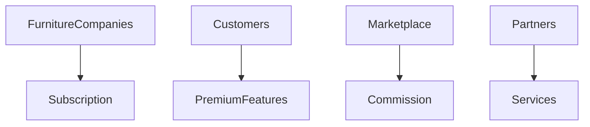
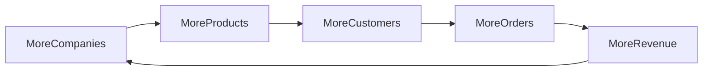

# Business Model Module

## 1. Overview

Furniture Platform biznes modeli oddiy ERP sotish emas.

Asosiy strategiya:

> Mebelchilar uchun operatsion tizim + mijozlar marketplace + AR savdo vositasi + AI yordamchi yaratish.

Platforma uch tomondan qiymat yaratadi:

1. Furniture Companies
2. Customers
3. Service Providers

---

# 2. Business Model Structure



---

# 3. Main Revenue Sources

Asosiy daromad kanallari:

1. SaaS Subscription
2. Marketplace Commission
3. AR Premium
4. Featured Listing
5. Additional Services
6. Enterprise Solutions

---

# 4. SaaS Subscription Model

Mebelchilar tizimdan foydalanish uchun oylik to'lov qiladi.

---

# 5. Package Structure

## Starter Package

Kichik ustaxonalar uchun.

Imkoniyatlar:

* mahsulot boshqaruvi;
* oddiy CRM;
* buyurtma tracking;
* basic inventory.

---

## Business Package

O'rta kompaniyalar uchun.

Qo'shimcha:

* ERP;
* xodimlar;
* ishlab chiqarish;
* ombor;
* hisobotlar.

---

## Premium Package

Professional kompaniyalar uchun.

Qo'shimcha:

* AR katalog;
* AI analytics;
* premium marketplace;
* ko'p filial;
* kengaytirilgan API.

---

# 6. Example Pricing Strategy

Narxlar bozor sinovidan o'tkaziladi.

Misol:

```text id="7m2q9x"
Starter:

$19-$49/month


Business:

$99-$199/month


Premium:

$299+/month
```

---

# 7. AR Monetization

AR platformaning katta qiymati.

Variantlar:

## Furniture Company

To'lov:

* 3D model hosting;
* AR katalog;
* professional presentation.

---

## Customer

Premium:

* ko'p model ko'rish;
* dizayn saqlash;
* xona loyihalari.

---

# 8. Marketplace Commission

Buyurtma orqali daromad.

Formula:

```text id="f4k8zn"
Platform Revenue =

Order Amount × Commission %
```

---

Misol:

Buyurtma:

$2000

Komissiya:

3%

Platform:

$60

---

# 9. Featured Listing

Mebelchilar ko'rinishni oshirish uchun to'laydi.

Misol:

* yuqori qator;
* premium badge;
* reklama.

---

# 10. Service Marketplace

Kelajakda:

Qo'shimcha xizmatlar:

* oboychilar;
* deraza ustalari;
* dizaynerlar;
* montajchilar.

---

Daromad:

* subscription;
* commission.

---

# 11. Customer Premium Model

Bepul:

* bitta AR model;
* basic qidiruv.

---

Premium:

* ko'p AR model;
* dizayn saqlash;
* AI tavsiyalar;
* loyiha yaratish.

---

# 12. Enterprise Model

Katta kompaniyalar uchun:

Qo'shimcha:

* maxsus server;
* API;
* integratsiya;
* shaxsiy support.

---

# 13. Growth Strategy

Boshlanish:

```text id="7v3k8s"
20 Furniture Companies

↓

100 Companies

↓

500 Companies

↓

Regional Marketplace
```

---

# 14. Network Effect

Platformaning kuchi:

Ko'proq mebelchi →

Ko'proq mahsulot →

Ko'proq mijoz →

Ko'proq buyurtma →

Ko'proq mebelchi.

---

# 15. Marketplace Flywheel



---

# 16. Customer Acquisition

Marketing kanallari:

* TikTok;
* Instagram;
* YouTube;
* AR videolar;
* influencer marketing.

---

# 17. Viral Growth Strategy

AR tajriba tabiiy marketing beradi.

Misol:

Mijoz:

"Yangi oshxonamni uyimda ko'rdim"

↓

Video oladi

↓

Instagram joylaydi

↓

Yangi foydalanuvchilar keladi.

---

# 18. Furniture Company Acquisition

Strategiya:

Avval ERP qiymatini sotish.

Keyin:

* marketplace;
* AR;
* mijoz oqimi.

---

# 19. Competitive Advantage

Platforma faqat:

ERP emas.

Faqat:

Marketplace emas.

Faqat:

AR app emas.

Ularning kombinatsiyasi:

```text id="m2j7vw"
ERP

+

Marketplace

+

AR Commerce

+

AI
```

---

# 20. International Expansion

Har bir davlat uchun:

* til;
* valyuta;
* qonun;
* lokal to'lov;
* lokal xizmat.

---

# 21. Country Launch Strategy

Yangi davlat:

```text id="q9m5vx"
No local companies

↓

Demo Mode

↓

Recruit Companies

↓

Activate Marketplace
```

---

# 22. Investor Kerakmi?

Boshlanish bosqichi:

Agar:

* MVP tayyor;
* 20-500 kompaniya;
* daromad bor;

bo'lsa, investor majburiy emas.

---

Investor kerak bo'lishi mumkin:

* xalqaro kengayish;
* katta marketing;
* AI infrastruktura;
* yangi bozor.

---

# 23. Long Term Vision

Platforma:

Furniture Operating System

bo'lishi mumkin.

Ya'ni:

Mebel biznesining kundalik ishlashi platforma orqali o'tadi.

---

# 24. Summary

Furniture Platform biznes modeli:

* SaaS daromadi;
* marketplace komissiyasi;
* AR xizmatlari;
* premium funksiyalar;
* xizmat marketplace

orqali ko'p manbali daromad yaratadi.

Asosiy aktiv:

> Mebelchilar tarmog'i + mijozlar oqimi + ishlab chiqarish ma'lumotlari.
