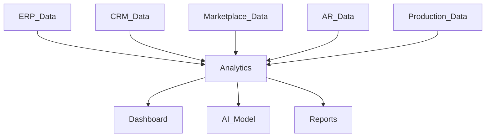
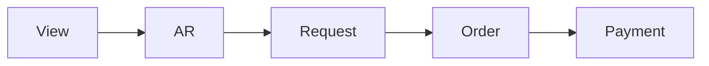

# Analytics and Business Intelligence Module

## 1. Overview

Analytics tizimi Furniture Platform ichidagi barcha jarayonlardan yig'ilgan ma'lumotlarni biznes qarorlariga aylantiradi.

Asosiy maqsad:

> Mebelchi, platforma egasi va kelajakdagi investor uchun aniq raqamlar orqali qaror qabul qilish imkoniyatini yaratish.

---

# 2. Analytics Architecture



---

# 3. Analytics Levels

Tizim 3 darajada ishlaydi:

## Company Analytics

Har bir mebelchi o'z biznesini ko'radi.

---

## Marketplace Analytics

Platforma umumiy bozorni ko'radi.

---

## AI Analytics

Kelajak prognozlari.

---

# 4. Company Dashboard

Mebelchi uchun asosiy panel.

Ko'rsatkichlar:

* sotuv;
* buyurtmalar;
* ishlab chiqarish;
* foyda;
* xodim samaradorligi.

---

# 5. Sales Analytics

Tahlil qilinadi:

* kunlik sotuv;
* oylik sotuv;
* kategoriya bo'yicha savdo;
* eng ko'p sotiladigan mahsulot.

---

Misol:

```text id="k8p3mx"
Top Product:

Kitchen Premium

Orders:
120

Revenue:
$240000
```

---

# 6. Customer Analytics

Ko'rsatkichlar:

* yangi mijozlar;
* qayta xarid;
* qiziqishlar;
* hududlar.

---

# 7. Marketplace Analytics

Platforma ko'radi:

* qaysi mahsulot ko'p ko'rildi;
* qaysi kategoriya trendda;
* qaysi davlatda talab bor.

---

# 8. AR Analytics

AR katta qiymat manbai bo'lgani uchun alohida kuzatiladi.

Ko'rsatkichlar:

* AR ochilish soni;
* ko'rilgan modellar;
* saqlangan dizaynlar;
* buyurtmaga aylanish.

---

Misol:

```text id="7v3m9q"
Product Views:

10000

AR Usage:

6500

Orders:

800
```

---

# 9. Conversion Funnel

Mijoz yo'li:



---

Tizim qayerda mijoz yo'qolayotganini ko'rsatadi.

---

# 10. Production Analytics

Ishlab chiqarish nazorati:

Ko'rsatkichlar:

* o'rtacha tayyorlash vaqti;
* kechikishlar;
* ishlab chiqarish quvvati.

---

# 11. Employee Analytics

Xodimlar:

* bajarilgan vazifalar;
* vaqt;
* samaradorlik.

---

Misol:

```text id="p9x2mv"
Employee:

Ali

Completed Tasks:
95

Average Time:
2.5 hours
```

---

# 12. Inventory Analytics

Ombor:

Ko'rsatiladi:

* material sarfi;
* ortiqcha zaxira;
* yetishmovchilik.

---

# 13. Financial Analytics

Moliyaviy ko'rsatkichlar:

* daromad;
* xarajat;
* foyda;
* tannarx.

---

Formula:

```text id="w5m8qx"
Profit =

Revenue - Costs
```

---

# 14. AI Data Pipeline

Analytics AI uchun asos bo'ladi.

Jarayon:

```text id="r8k3mz"
Raw Data

↓

Cleaning

↓

Analysis

↓

Machine Learning

↓

Prediction
```

---

# 15. Business Intelligence Reports

Avtomatik hisobotlar:

* haftalik;
* oylik;
* yillik.

---

Misol:

```text id="m4q7xp"
Monthly Report:

Sales +18%

Production Time -12%

Customer Satisfaction +20%
```

---

# 16. Owner AI Assistant

Kelajakda kompaniya egasi savol beradi:

"Bu oy nima o'zgardi?"

AI javob beradi:

```text id="x3n8mv"
Sales increased.

Main reason:
Kitchen category growth.

Recommendation:
Increase production capacity.
```

---

# 17. Marketplace Intelligence

Platforma uchun:

Tahlil:

* bozor trendi;
* narxlar;
* talab.

---

# 18. Recommendation Engine

Analytics asosida:

Mijozga:

* mos mahsulot;
* mos kompaniya;
* mos narx.

---

# 19. Data Privacy

Muhim qoida:

Kompaniyalar:

faqat o'z ma'lumotlarini ko'radi.

Platforma esa:

anonim statistikadan foydalanishi mumkin.

---

# 20. Dashboard Roles

## Owner Dashboard

Biznes ko'rinishi.

---

## Manager Dashboard

Operatsion nazorat.

---

## Employee Dashboard

Vazifalar.

---

## Customer Dashboard

Buyurtma holati.

---

# 21. Future Features

Qo'shilishi mumkin:

* real-time BI;
* AI forecasting;
* automated business decisions;
* market prediction.

---

# 22. Summary

Analytics and BI moduli Furniture Platformni oddiy dasturdan biznes boshqaruv tizimiga aylantiradi.

U:

* kompaniyaga nazorat;
* platformaga bozor tushunchasi;
* AI uchun bilim bazasi

yaratadi.

Asosiy aktiv:

> Vaqt o'tishi bilan yig'iladigan sifatli biznes ma'lumotlari.
