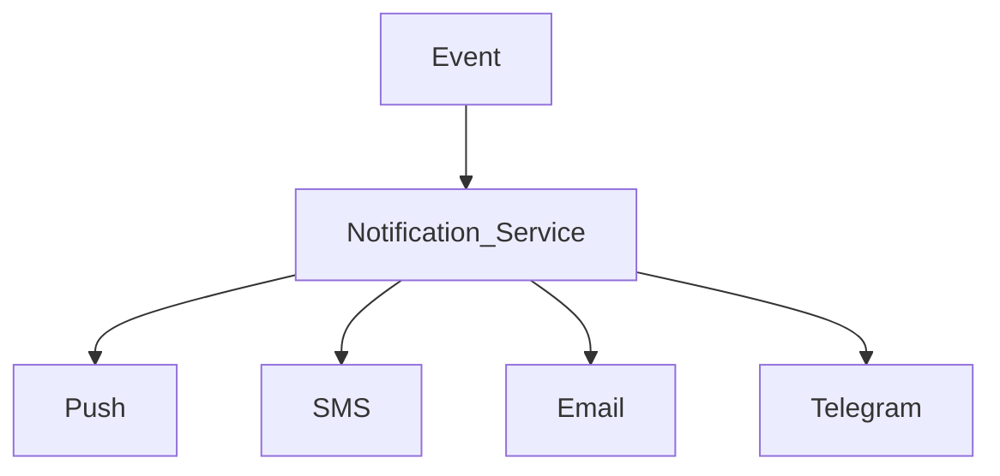

# Notification System Module

## 1. Overview

Notification System Furniture Platform ichidagi barcha ishtirokchilar o'rtasida tezkor aloqa yaratadi.

Asosiy maqsad:

> Mijoz, mebelchi, xodim va platforma o'rtasidagi barcha muhim jarayonlarni avtomatik yetkazish.

---

# 2. Notification Participants

Tizim quyidagi foydalanuvchilarga xabar yuboradi:

1. Customer
2. Company Owner
3. Manager
4. Employee
5. Supplier
6. Platform Admin

---

# 3. Notification Architecture



---

# 4. Notification Types

Asosiy turlar:

* Order notification;
* Production notification;
* Payment notification;
* Marketing notification;
* System notification.

---

# 5. Customer Notifications

Mijoz uchun:

## Order Created

```text id="a7x2mp"
Buyurtmangiz qabul qilindi.

Status:
Tasdiqlash kutilmoqda.
```

---

## Production Started

```text id="b8m4qz"
Mebelingiz ishlab chiqarishga berildi.
```

---

## Ready Notification

```text id="c9v5mx"
Buyurtmangiz tayyor.

Yetkazib berish sanasi:
12-avgust.
```

---

# 6. Order Status Tracking

Mijoz doim ko'radi:

```text id="k5p8nw"
Created

↓

Confirmed

↓

Production

↓

Quality Check

↓

Delivery

↓

Completed
```

---

# 7. Company Notifications

Mebelchi uchun:

Misollar:

* yangi buyurtma;
* yangi mijoz;
* to'lov;
* kechikish.

---

# 8. Employee Notifications

Xodimga:

## New Task

```text id="m3q7vx"
Yangi vazifa:

Mijoz uyiga tashrif

Manzil:
*****

Vaqt:
15:00
```

---

# 9. Production Notifications

Ishlab chiqarish jarayoni:

```text id="p8x4mz"
Order #1001

Material tayyor

↓

Kesish boshlandi

↓

Yig'ish boshlandi

↓

Tayyor
```

---

# 10. Real-Time Communication

Real-time uchun:

* WebSocket;
* Push notification.

---

Misol:

Xodim statusni o'zgartiradi:

```text id="r6m2qw"
Production

↓

Ready
```

Mijozga avtomatik keladi.

---

# 11. Telegram Integration

O'zbekiston va MDH bozorida foydali.

Qo'llash:

* kompaniya adminlari;
* xodimlar;
* bot orqali monitoring.

---

Misol:

```text id="x9m5kp"
Yangi buyurtma:

Kitchen Premium

Narx:
25 000 000 UZS
```

---

# 12. SMS Integration

Muhim holatlar uchun:

* login;
* tasdiqlash kodi;
* buyurtma.

---

# 13. Email Notification

Professional kompaniyalar uchun:

* invoice;
* hisobot;
* hujjatlar.

---

# 14. Notification Queue

Ko'p xabarlar uchun:

```text id="z4m7qx"
Event

↓

Queue

↓

Worker

↓

Send Notification
```

---

# 15. User Preferences

Foydalanuvchi tanlaydi:

Masalan:

```text id="q7x3mv"
Push:
ON

SMS:
OFF

Email:
ON
```

---

# 16. Notification Templates

Barcha xabarlar shablon orqali.

Misol:

```text id="w8m2pz"
Hello {name}

Your order {order_id}

status changed to {status}
```

---

# 17. Smart Notification

AI yordamida:

Muhim xabarlarni ajratish.

Misol:

Oddiy:

"Material qoldi."

Muhim:

"Material 2 kundan keyin tugaydi."

---

# 18. Marketing Notifications

Kelajak:

Mijozga:

* yangi kolleksiya;
* chegirma;
* dizayn tavsiyasi.

---

# 19. Anti-Spam System

Himoya:

* limit;
* frequency control;
* user preferences.

---

# 20. Notification Analytics

O'lchanadi:

* ochilish;
* bosish;
* javob;
* konversiya.

---

# 21. Future Features

Qo'shilishi mumkin:

* AI sales assistant;
* voice notification;
* WhatsApp integration;
* automated customer follow-up.

---

# 22. Summary

Notification System platformadagi barcha jarayonlarni jonli qiladi.

U:

* mijoz ishonchini oshiradi;
* mebelchi ishini tezlashtiradi;
* buyurtmalarni nazorat qiladi.

Asosiy qiymat:

> "Mijoz hech qachon o'z mebeli nima bo'lganini so'rab qo'ng'iroq qilmaydi, tizim o'zi aytib turadi."
