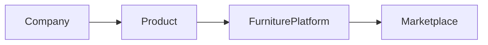
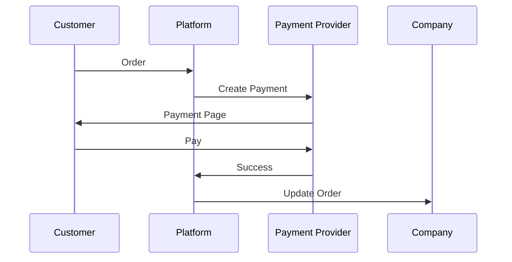

# Integration System Module

## 1. Overview

Furniture Platform yopiq dastur emas, balki boshqa tizimlar bilan ishlay oladigan ekotizim sifatida quriladi.

Asosiy maqsad:

> Mebel biznesidagi barcha jarayonlarni yagona platformaga ulash.

---

# 2. Integration Philosophy

Platforma quyidagi tamoyil asosida quriladi:

```text id="7m2x8q"
External System

↓

API Layer

↓

Furniture Platform

↓

Business Logic
```

---

# 3. Integration Categories

Asosiy integratsiyalar:

1. Marketplace
2. Payment
3. Delivery
4. Communication
5. Supplier
6. Accounting
7. Government Services

---

# 4. Marketplace Integration

Kelajakda:

* lokal marketplace;
* xalqaro marketplace;
* kompaniyaning o'z sayti.

---

# 5. Product Synchronization

Jarayon:



---

Sinxronizatsiya:

* nom;
* rasm;
* narx;
* qoldiq;
* status.

---

# 6. Seller Link Integration (davomi)

Muhim strategiya:

Mebelchi o'zining tashqi sahifasi bilan bog'lanadi.

Misol:

```text
Company Profile

↓

External Marketplace URL

↓

Furniture Platform
```

Maqsad:

* sotuvchining mavjud auditoriyasini saqlash;
* platformaga ishonchni oshirish;
* mahsulot manbasini ko'rsatish.

---

# 7. Marketplace Import System

Kelajakda:

Mebelchi mavjud katalogini import qilishi mumkin.

Import manbalari:

* CSV;
* Excel;
* API;
* XML;
* boshqa marketplace.

---

Jarayon:

```text
Existing Catalog

↓

Import Service

↓

Validation

↓

Furniture Platform Catalog
```

---

# 8. Payment Integration

Platformada to'lov tizimi bo'lishi kerak.

Qo'llab-quvvatlanadi:

* karta;
* bank o'tkazmasi;
* online payment;
* invoice.

---

# 9. Payment Flow



---

# 10. Payment Security

Saqlanadi:

* transaction ID;
* payment status;
* history.

Muhim qoida:

Platforma bank karta ma'lumotlarini saqlamaydi.

---

# 11. Delivery Integration

Kelajakda:

* kuryer;
* logistika kompaniyalari;
* o'z transporti.

---

# 12. Delivery Workflow

```text
Production Finished

↓

Delivery Request

↓

Courier Assigned

↓

Tracking

↓

Delivered
```

---

# 13. Communication Integration

Tashqi aloqa:

* Telegram;
* SMS;
* Email;
* WhatsApp.

---

# 14. Telegram Integration

O'zbekiston va MDH uchun foydali.

Qo'llanish:

## Company Bot

* yangi buyurtma;
* ishlab chiqarish;
* hisobot.

---

## Customer Bot

* buyurtma holati;
* savollar;
* bildirishnoma.

---

# 15. Supplier Integration

Kelajakda xomashyo yetkazib beruvchilar ulanadi.

Misol:

Mebelchi:

```text
Need MDF

↓

Supplier Search

↓

Price Comparison

↓

Order
```

---

# 16. Accounting Integration

Kompaniyalar uchun:

* buxgalteriya;
* moliya;
* invoice.

---

Integratsiya:

* eksport;
* import;
* avtomatik hisobot.

---

# 17. Government Integration

Turli davlatlarda:

* soliq;
* elektron hisob-faktura;
* biznes registrlari.

---

# 18. API Partner Platform

Kelajakda uchinchi tomonlar uchun:

Developer API.

Misol:

```text
Designer App

↓

Furniture API

↓

Product Database
```

---

# 19. Webhook System

Real-time integratsiya uchun.

Misol:

Order o'zgardi:

```text
Order Status Changed

↓

Webhook

↓

External System Updated
```

---

# 20. Integration Security

Har bir integratsiya:

* API Key;
* OAuth;
* permission;
* rate limit

bilan himoyalanadi.

---

# 21. Data Synchronization

Muammo:

Ikki tizimdagi ma'lumot farqi.

Yechim:

* timestamp;
* version control;
* sync queue.

---

# 22. Error Handling

Agar integratsiya ishlamasa:

```text
Request

↓

Failed

↓

Retry Queue

↓

Admin Notification
```

---

# 23. Integration Dashboard

Admin ko'radi:

* ulangan servislar;
* xatolar;
* trafik;
* API ishlashi.

---

# 24. Future Integrations

Qo'shilishi mumkin:

* smart home;
* interior design apps;
* architecture software;
* VR showroom;
* AI design platforms.

---

# 25. Strategic Value

Integratsiya platformaning yopiq emasligini ta'minlaydi.

Natija:

```text
Furniture Platform

=

Central Hub

+

Business Network
```

---

# 26. Summary

Integration System Furniture Platformni oddiy ERP emas, balki butun mebel sanoati uchun raqamli infratuzilmaga aylantiradi.

U:

* marketplace;
* to'lov;
* yetkazib berish;
* supplier;
* boshqa dasturlar

bilan yagona ekotizim yaratadi.

Uzoq muddatli maqsad:

> Mebel biznesidagi barcha raqamli jarayonlar Furniture Platform orqali o'tishi.
