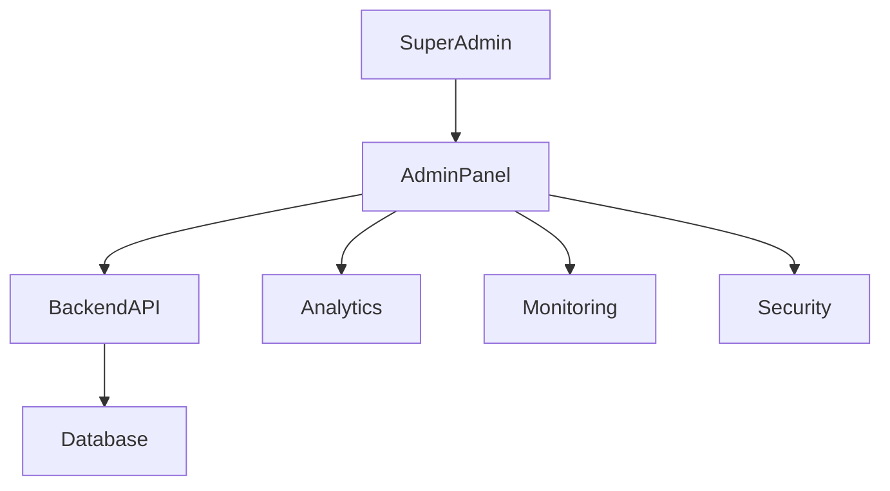

# Admin Panel and Backoffice Module

## 1. Overview

Admin Panel Furniture Platformning markaziy boshqaruv tizimi hisoblanadi.

Bu panel orqali platforma egasi:

* kompaniyalarni;
* foydalanuvchilarni;
* marketplace;
* to'lovlarni;
* tariflarni;
* xavfsizlikni

boshqaradi.

Asosiy maqsad:

> Platformani katta hajmda nazorat qilish va avtomatlashtirilgan boshqaruv yaratish.

---

# 2. Admin Architecture



---

# 3. Admin Roles

Tizimda bir nechta admin darajasi bo'lishi mumkin.

---

## Super Admin

To'liq huquq:

* barcha davlatlar;
* barcha kompaniyalar;
* moliya;
* konfiguratsiya.

---

## Country Admin

Muayyan davlat uchun.

Misol:

```text id="p8x2mv"
Uzbekistan Admin

Kazakhstan Admin
```

---

## Support Admin

Faqat:

* foydalanuvchi muammolari;
* murojaatlar.

---

## Moderator

Marketplace nazorati.

---

# 4. Dashboard Overview

Bosh sahifada:

Ko'rsatkichlar:

* jami kompaniyalar;
* aktiv foydalanuvchilar;
* buyurtmalar;
* daromad;
* AR ishlatish;
* server holati.

---

Misol:

```text id="m9x4qp"
Companies:

540

Active Users:

42 000

Monthly Revenue:

$35 000
```

---

# 5. Company Management

Admin boshqaradi:

* kompaniya ro'yxati;
* tasdiqlash;
* bloklash;
* tarif.

---

Company status:

```text id="7z3mwq"
Pending

↓

Verified

↓

Premium

↓

Suspended
```

---

# 6. Company Verification

Tekshiriladi:

* biznes ma'lumotlari;
* telefon;
* hujjatlar;
* manzil.

---

Maqsad:

Marketplace ishonchliligini oshirish.

---

# 7. User Management

Admin:

* user qidiradi;
* status o'zgartiradi;
* faoliyatini ko'radi.

---

Nazorat:

* loginlar;
* qurilmalar;
* xavfsizlik hodisalari.

---

# 8. Product Moderation

Marketplace uchun.

Tekshiriladi:

* mahsulot sifati;
* rasm;
* tavsif;
* 3D model.

---

Status:

```text id="x8m2pv"
Draft

↓

Review

↓

Approved

↓

Published
```

---

# 9. 3D Model Management

Admin ko'radi:

* yuklangan modellar;
* hajm;
* format;
* optimizatsiya holati.

---

Qoidalar:

* zararli fayllar;
* sifatsiz modellar;
* noto'g'ri kontent.

---

# 10. Subscription Management

Tariflar:

Admin yaratadi:

```text id="q5m9vx"
Starter

Business

Premium

Enterprise
```

---

Boshqariladi:

* narx;
* limit;
* funksiyalar.

---

# 11. Payment Management

Ko'riladi:

* tushum;
* tranzaksiyalar;
* refund;
* subscription.

---

# 12. Commission Management

Marketplace uchun:

Admin belgilaydi:

```text id="n6x3mq"
Category Commission:

3%

Premium Seller:

2%
```

---

# 13. Support System

Ichki yordam tizimi.

Funksiyalar:

* ticket;
* chat;
* murojaat tarixi.

---

# 14. Content Management

Platformadagi:

* banner;
* kategoriya;
* tavsiya;
* maqola

boshqariladi.

---

# 15. Localization Management

Har davlat uchun:

* til;
* valyuta;
* matn;
* qoidalar.

---

Misol:

```json id="h3m8qp"
{
"country":"UZ",
"currency":"UZS",
"language":"uz"
}
```

---

# 16. System Configuration

Admin sozlaydi:

* limitlar;
* API;
* notification;
* security.

---

# 17. Audit System

Admin harakati ham yoziladi.

Misol:

```text id="r4m7vx"
Admin:

Changed Company Status

Old:
Pending

New:
Verified
```

---

# 18. Fraud Monitoring

Aniqlanadi:

* soxta akkauntlar;
* spam;
* shubhali harakatlar.

---

# 19. Analytics Access

Admin:

platforma bo'yicha:

* o'sish;
* daromad;
* retention;
* aktivlik

ni ko'radi.

---

# 20. Platform Health Monitoring

Nazorat:

* server;
* database;
* API;
* queue.

---

# 21. Automation Rules

Admin avtomatik qoidalar yaratishi mumkin.

Misol:

```text id="y8k2mq"
If company inactive 90 days

↓

Send reminder

↓

Suspend after 30 days
```

---

# 22. Future AI Admin Assistant

Kelajak:

Admin savol beradi:

"Qaysi davlat tez o'smoqda?"

AI:

```text id="t6m9xp"
Kazakhstan market grew 42%.

Recommendation:
Increase sales activity there.
```

---

# 23. Security Rules

Admin uchun:

* 2FA;
* IP monitoring;
* session control.

---

# 24. Summary

Admin Panel Furniture Platformning boshqaruv markazi hisoblanadi.

U:

* biznes nazorati;
* marketplace moderatsiyasi;
* xavfsizlik;
* moliya;
* global boshqaruv

uchun asos bo'ladi.

To'g'ri qurilgan Backoffice platformani yuzlab kompaniyadan minglab kompaniyagacha olib chiqish imkonini beradi.
