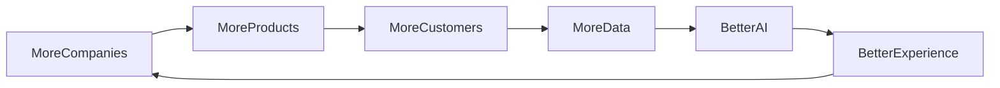

# AI and Data Strategy Module

## 1. Overview

Furniture Platformning eng katta uzoq muddatli qiymati faqat dastur emas, balki yig'iladigan sifatli ma'lumotlar bo'ladi.

Platforma vaqt o'tishi bilan:

* mebel bozori;
* narxlar;
* materiallar;
* dizayn trendlar;
* mijoz xulqi;
* ishlab chiqarish jarayonlari

haqida katta bilim bazasiga ega bo'ladi.

Asosiy maqsad:

> Ma'lumotlarni aqlli tizimlar orqali biznes qiymatiga aylantirish.

---

# 2. Data Flywheel

Platformaning o'sish mexanizmi:



---

# 3. Data Sources

Platforma quyidagi manbalardan ma'lumot oladi:

## ERP Data

* material sarfi;
* ishlab chiqarish;
* xarajat;
* vaqt.

---

## Marketplace Data

* ko'rishlar;
* qidiruvlar;
* buyurtmalar;
* trendlar.

---

## AR Data

* qaysi model ko'rildi;
* qaysi dizayn tanlandi;
* xona turi.

---

## CRM Data

* mijozlar;
* so'rovlar;
* sotuv jarayoni.

---

# 4. Data Ownership Strategy

Muhim tamoyil:

Kompaniya ma'lumotlari:

* kompaniyaga tegishli.

Platforma:

* xizmat ko'rsatish uchun foydalanadi.

---

Anonimlashtirilgan ma'lumot:

Platformani yaxshilash uchun ishlatilishi mumkin.

---

# 5. Data Layers

Arxitektura:

```text id="k5m8px"
Operational Data

↓

Analytics Data

↓

AI Training Data

↓

AI Models
```

---

# 6. Data Warehouse

Kelajakda:

Alohida analitik baza.

Saqlaydi:

* tarixiy ma'lumot;
* trend;
* statistikalar.

---

# 7. AI Model Categories

Platformada bir nechta AI yo'nalishlari bo'ladi.

---

## Price Prediction AI

Narxni taxmin qiladi.

Input:

* material;
* o'lcham;
* dizayn;
* vaqt.

Output:

* taxminiy narx.

---

# 8. Demand Prediction AI

Taxmin qiladi:

* qaysi mebel trendda;
* qaysi mavsumda talab oshadi.

---

Misol:

```text id="m8x3qv"
September:

Kitchen demand +35%

Recommendation:

Increase production.
```

---

# 9. Recommendation AI

Mijozga:

* mos mebel;
* mos kompaniya;
* mos dizayn.

---

# 10. Design AI

Kelajakdagi kuchli modul.

Input:

* xona rasmi;
* o'lcham;
* uslub.

Output:

* interyer tavsiyasi;
* mebel joylashuvi.

---

# 11. Production Optimization AI

Ishlab chiqarishni yaxshilaydi.

Tahlil:

* ish vaqti;
* xodim;
* material.

---

Natija:

* kam chiqindi;
* tez ishlab chiqarish.

---

# 12. AI Business Assistant

Har bir kompaniya uchun virtual yordamchi.

Misol:

Owner:

"Bugun nima muammo bor?"

AI:

```text id="v9m2qx"
3 orders delayed.

Reason:

MDF shortage.

Recommendation:

Contact supplier.
```

---

# 13. Computer Vision Integration

Kelajak:

Kamera orqali:

* xona o'lchash;
* material aniqlash;
* mahsulot tekshirish.

---

# 14. AR + AI Combination

Eng katta ustunlik:

```text id="q7m4xp"
Camera

↓

AI Understanding

↓

3D Placement

↓

Smart Recommendation
```

---

# 15. Data Collection Ethics

Muhim:

* foydalanuvchi roziligi;
* maxfiylik;
* xavfsiz saqlash.

---

# 16. AI Infrastructure

Bosqichma-bosqich:

## MVP

Oddiy algoritmlar.

---

## Growth

Machine Learning.

---

## Scale

Deep Learning + LLM.

---

# 17. Model Training Pipeline

```text id="r5x8mq"
Data Collection

↓

Cleaning

↓

Labeling

↓

Training

↓

Validation

↓

Deployment
```

---

# 18. AI API Layer

AI alohida servis bo'lishi mumkin.

```text id="n3m7qx"
Backend

↓

AI API

↓

Models

↓

Prediction
```

---

# 19. Competitive Advantage

Vaqt o'tishi bilan:

Yangi raqobatchi faqat kod yozishi mumkin.

Lekin:

* yillar davomida yig'ilgan data;
* kompaniyalar tarmog'i;
* AI modellari

nusxalash qiyin bo'ladi.

---

# 20. Future AI Products

Kelajakda alohida sotilishi mumkin:

* AI Designer;
* AI Sales Assistant;
* AI Production Planner;
* AI Market Analyst.

---

# 21. Strategic Vision

Oxirgi maqsad:

Furniture Platform:

```text id="x9m4pv"
ERP

+

Marketplace

+

AR

+

AI

+

Industry Data Platform
```

bo'lishi.

---

# 22. Summary

AI va Data Strategy platformaning uzoq muddatli himoya devori hisoblanadi.

Birinchi yillarda:

platforma foydalanuvchilarga xizmat beradi.

Keyinchalik:

platforma yig'ilgan bilim orqali ularga aqlli qarorlar bera boshlaydi.

Eng katta aktiv:

> Mebel sanoatining raqamli bilim bazasi.
