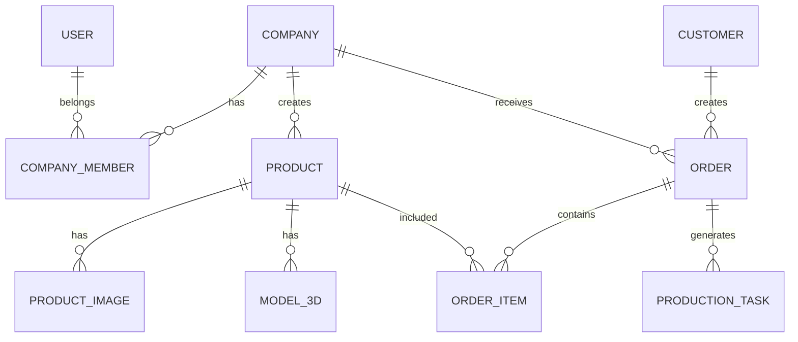

# Database ERD Full Specification

## 1. Overview

Furniture Platform uchun database oddiy mahsulot bazasi emas.

U quyidagilarni boshqaradi:

* kompaniyalar;
* xodimlar;
* mijozlar;
* mahsulotlar;
* 3D modellar;
* buyurtmalar;
* ishlab chiqarish;
* ombor;
* to'lov;
* marketplace;
* analytics.

Asosiy database:

> PostgreSQL

---

# 2. Database Design Principles

Asosiy qoidalar:

* normalizatsiya;
* kengaytiriladigan struktura;
* ko'p davlatli ishlash;
* role based access;
* audit log.

---

# 3. Core Entity Diagram



---

# 4. User Table

## users

Barcha tizim foydalanuvchilari.

```text
id
first_name
last_name
phone
email
password_hash
country_id
language
status
created_at
updated_at
```

---

# 5. Role System

## roles

```text
id

name
```

Misollar:

```text
SUPER_ADMIN

COMPANY_OWNER

MANAGER

EMPLOYEE

CUSTOMER
```

---

## user_roles

```text
id

user_id

role_id
```

---

# 6. Country Table

## countries

Global ishlash uchun.

```text
id

name

code

currency

language

timezone
```

---

Misol:

```text
Uzbekistan

UZ

UZS
```

---

# 7. Company Module

## companies

Mebel kompaniyalari.

```text
id

name

description

logo

phone

address

country_id

status

subscription_id

created_at
```

---

# 8. Company Members

## company_members

Xodimlar.

```text
id

company_id

user_id

position

permissions
```

---

Misol:

```text
Owner

Manager

Designer

Installer
```

---

# 9. Product Module

## products

Asosiy mahsulot.

```text
id

company_id

category_id

name

description

price

material

width

height

depth

status

created_at
```

---

# 10. Product Category

## categories

```text
id

name

parent_id
```

---

Misol:

```text
Furniture

 ├── Kitchen

 ├── Bedroom

 ├── Sofa

 └── Office
```

---

# 11. Product Images

## product_images

```text
id

product_id

file_url

type

order
```

---

# 12. 3D Model System

## models_3d

AR uchun.

```text
id

product_id

file_url

format

size

poly_count

optimized

status
```

---

Qo'llanadigan formatlar:

```text
USDZ

GLB

FBX
```

---

# 13. Customer Module

## customers

```text
id

user_id

name

phone

address

city

created_at
```

---

# 14. Order System

## orders

```text
id

customer_id

company_id

status

total_price

created_at
```

---

Status:

```text
NEW

CONFIRMED

PRODUCTION

READY

DELIVERY

COMPLETED
```

---

# 15. Order Items

## order_items

```text
id

order_id

product_id

quantity

price
```

---

# 16. Production Module

## production_tasks

Ishlab chiqarish bosqichlari.

```text
id

order_id

employee_id

stage

status

started_at

finished_at
```

---

Misol:

```text
Cutting

Assembly

Painting

Quality Check
```

---

# 17. Material Inventory

## materials

Xomashyo.

```text
id

company_id

name

unit

quantity
```

---

# 18. Material Usage

## material_usage

```text
id

production_task_id

material_id

amount
```

---

# 19. Supplier Module

## suppliers

```text
id

company_id

name

phone

category
```

---

# 20. Payment Module

## payments

```text
id

order_id

amount

method

status

transaction_id
```

---

# 21. Subscription System

## subscriptions

Tariflar.

```text
id

name

price

period

features
```

---

Misol:

```text
Starter

Business

Premium
```

---

# 22. Company Subscription

## company_subscriptions

```text
id

company_id

subscription_id

start_date

end_date

status
```

---

# 23. Marketplace Module

## listings

Platformadagi mahsulot e'lonlari.

```text
id

company_id

product_id

visibility

featured
```

---

# 24. AR Analytics

## ar_sessions

AR ishlatilishi.

```text
id

user_id

product_id

device

duration

created_at
```

---

# 25. Notification System

## notifications

```text
id

user_id

type

title

message

read

created_at
```

---

# 26. Audit Log

## audit_logs

Muhim o'zgarishlar.

```text
id

user_id

action

model

old_data

new_data

created_at
```

---

# 27. Analytics Events

## events

AI va BI uchun.

```text
id

user_id

event_type

metadata

created_at
```

---

Misollar:

```text
PRODUCT_VIEW

AR_OPEN

ORDER_CREATED

SEARCH
```

---

# 28. Database Scaling Strategy

Boshlanish:

```text
Single PostgreSQL
```

---

Keyinchalik:

```text
Primary DB

+

Read Replicas

+

Analytics Warehouse
```

---

# 29. Security

Database himoyasi:

* encryption;
* permission;
* backup;
* audit.

---

# 30. Future Tables

Kelajakda:

* designers;
* service_providers;
* delivery;
* reviews;
* AI_predictions;
* recommendation_logs.

---

# 31. Final Database Vision

Database oddiy CRUD uchun emas.

U quyidagilar uchun asos bo'ladi:

```text
Business Operations

+

Marketplace

+

AR

+

AI

+

Analytics
```

---

# 32. Summary

Furniture Platform database arxitekturasi:

* MVP uchun yetarlicha sodda;
* katta platformaga kengayadigan;
* xalqaro ishlashga tayyor

qilib loyihalanadi.

Asosiy prinsip:

> Bugungi MVP uchun oddiy, ertangi ekotizim uchun kuchli.
